# Kyberion

<p align="center">
  
</p>

<p align="center">
  <a href="https://opensource.org/licenses/MIT"></a>
  <a href="https://nodejs.org/">=24" src="https://img.shields.io/badge/Node.js-%3E%3D24.0.0-339933.svg?logo=node.js" /></a>
  <a href="https://github.com/famaoai-creator/kyberion/actions/workflows/ci.yml"></a>
  
</p>

<p align="center">
  
  
  
  
  
</p>

<p align="center"><strong>An organization work loop engine.</strong><br />You phrase outcomes. Kyberion plans, runs, and remembers with evidence.</p>

<p align="center">Intent → Plan → Result</p>

Every request has a visible plan, result, and next action.

Kyberion turns a request into a clear plan and a verified result. You ask `今週の進捗レポートを作って` or `この PDF をパワポにして`, and it selects the right tools, asks only when something is genuinely ambiguous, and returns the result plus an artifact plus evidence that future work can build on.

**For people new to the repo**

- If you want to try it quickly, start with [`docs/QUICKSTART.md`](./docs/QUICKSTART.md).
- If you want to understand what it does, read [`docs/WHY.md`](./docs/WHY.md) and [`docs/SCENARIO_CATALOG.md`](./docs/SCENARIO_CATALOG.md).
- If you want to extend it, jump to [`docs/developer/EXTENSION_POINTS.md`](./docs/developer/EXTENSION_POINTS.md) and [`CAPABILITIES_GUIDE.md`](./CAPABILITIES_GUIDE.md).
- If a term is unfamiliar, check the [`Glossary`](./docs/GLOSSARY.md) — it has three tiers: first-win, contributor, and FDE.

**Why this matters**: knowledge work is moving from "I do this manually with LLM help" to "I delegate and verify". The winning system is not the most chat-fluent model, but the engine that captures intent reliably, keeps evidence, and accumulates organizational memory. See [`docs/WHY.md`](./docs/WHY.md) for the full thesis ([日本語版](./docs/WHY.ja.md)).

---

## What Makes It Different

<p align="center">
  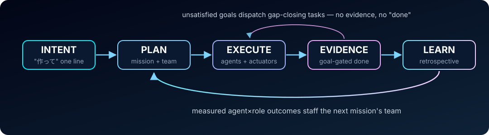
</p>

Most agent frameworks stop at "execute". Kyberion closes the loop:

- **No evidence, no "done".** Finishing a work cycle checks every success criterion against actual artifacts and verifications. Unsatisfied gaps automatically dispatch gap-closing work — the wording of a request never substitutes for its purpose.
- **The work loop improves itself.** Every finished work cycle runs a retrospective: deterministic execution stats ground improvement proposals (human-ratified, never auto-applied), and measured outcomes improve future staffing. Your instance gets measurably better the more you use it.
- **Frontier-model discipline on any model.** The working philosophy — read before write, one change one verification, no retry without a new hypothesis, evidence-based completion — is codified as mechanical rules ([working-philosophy](./knowledge/product/governance/working-philosophy.md)) and injected into every worker prompt, so fast/small models inherit the habits that make frontier models reliable.
- **Governance by architecture, not by prompt.** Three-tier knowledge isolation is enforced at the file-IO boundary. Customer conversations are physically separated from mission state. Outbound sends always pass an approval gate. An append-only audit chain records everything.
- **Workers get briefed, not dumped.** Each dispatched worker receives a role-scoped mission context pack — the mission goal, acceptance criteria, and the top knowledge hints distilled from previous runs — under an explicit size budget, with automatic compaction on long runs. Delegation is a briefing, not a context dump.

---

## Quick Start

> **Canonical cold-start source: [`docs/QUICKSTART.md`](./docs/QUICKSTART.md).** This page is a short overview; use Quickstart for the exact first-win command order. Day-2 tenant / organization / activation work is documented in [`docs/INITIALIZATION.md`](./docs/INITIALIZATION.md). The category-level documentation map is [`docs/documentation-source-map.json`](./docs/documentation-source-map.json).

Kyberion's first visible result comes in three short paths:

- 30 seconds: run `pnpm doctor` and see Kyberion's readiness/value boundary
- 5 minutes: run the clean browser smoke and get `active/shared/tmp/first-win-session.png`
- 15 minutes: read the Quickstart structure map, then inspect the pipeline and actuator entrypoints

### First-win shortest paths (one table)

| Path            | Prerequisites                                    | Time         | Command                                            | Notes                                                                                                                                 |
| :-------------- | :----------------------------------------------- | :----------- | :------------------------------------------------- | :------------------------------------------------------------------------------------------------------------------------------------ |
| First-win       | Node 24+, pnpm                                   | ~5min        | Quickstart's five commands                         | Writes `active/shared/tmp/first-win-session.png` (or the governed fallback)                                                           |
| Voice first-win | macOS only (native TTS; not available in Docker) | ~5min        | `pnpm pipeline --input pipelines/voice-hello.json` | Run after the browser smoke                                                                                                           |
| Docker path     | Docker Desktop                                   | ~10min build | `docker compose --profile deploy up`               | Headless services only — voice/GUI actuators need the native macOS path. Final image boot verification is tracked in the ops backlog. |

The canonical first-win command sequence is:

# kyberion-first-win

```bash
pnpm install
pnpm build
pnpm env:bootstrap --manifest kyberion-toolchain
pnpm doctor
pnpm pipeline --input pipelines/verify-session.json
```

If a browser, voice, or media actuator is missing a local dependency, inspect it directly with the on-demand pull resolver:

```bash
pnpm deps:check --actuator browser
pnpm deps:check --actuator voice
pnpm deps:check --actuator media-generation
```

Requires Node.js 24+ (`.nvmrc` / `package.json` engines) and pnpm.

```bash
git clone https://github.com/famaoai-creator/kyberion.git
cd kyberion
pnpm install
pnpm build
pnpm env:bootstrap --manifest kyberion-toolchain # verifies Node 24+ floor; warns if Playwright browsers are missing
pnpm doctor
pnpm pipeline --input pipelines/verify-session.json
```

`pnpm exec playwright install chromium` is optional. If Chromium is unavailable, the
pipeline writes its governed text fallback instead of hiding the readiness result.

If you already have onboarding JSON, use Path B instead of the wizard:

```bash
pnpm onboard apply --identity knowledge/public/templates/onboarding/identity.example.json --dry-run
```

Copy that template, edit it for your identity, then rerun without `--dry-run` to write the onboarding artifacts.

Then pick a smoke path:

```bash
# Clean browser smoke: opens a local first-win page and writes active/shared/tmp/first-win-session.png
pnpm pipeline --input pipelines/verify-session.json

# Voice smoke: browser speech in, OS-native speech out
pnpm pipeline --input pipelines/voice-hello.json
```

To understand the structure in 15 minutes, read [`docs/QUICKSTART.md`](./docs/QUICKSTART.md) sections 4-10, then inspect [`pipelines/verify-session.json`](./pipelines/verify-session.json), [`CAPABILITIES_GUIDE.md`](./CAPABILITIES_GUIDE.md), and [`docs/developer/EXTENSION_POINTS.md`](./docs/developer/EXTENSION_POINTS.md).

If you do not know which surface to use next, `pnpm kyberion setup report --persona first-time-user` now acts as the entry guide. It tells you whether to start with Chronos, the concierge, the voice path, or a messaging surface, and whether auth/setup is still blocking that route.

Chronos API routes use a viewer principal and server-side tenant scope: every route except `/api/healthz` resolves a `ViewerContext` fail-closed, and enforcement is staged via `KYBERION_VIEWER_SCOPE=off|warn|enforce` (default `warn`; see [`docs/developer/CHRONOS_VIEWER_SCOPE_OPERATIONS.ja.md`](./docs/developer/CHRONOS_VIEWER_SCOPE_OPERATIONS.ja.md)). `KYBERION_API_TOKEN` / `KYBERION_LOCALADMIN_TOKEN` remain compatible all-tenant tokens for the single-operator local workflow; scoped token registrations can restrict a viewer to selected tenants. A proper IdP-backed user session, SSO, and human user management remain follow-up items and are not implied by this boundary.

For a concise map of entry points and their intended use, read [`docs/SURFACES.md`](./docs/SURFACES.md).
For the full canonical setup, see [`docs/INITIALIZATION.md`](./docs/INITIALIZATION.md) (structure map: [`docs/QUICKSTART.md`](./docs/QUICKSTART.md)). For deployment to a server / customer environment, see [`docs/operator/DEPLOYMENT.md`](./docs/operator/DEPLOYMENT.md).

---

## What It Covers

Kyberion currently covers:

- **Browser automation**: record a web flow once, replay it reliably.
- **Voice workflows**: browser speech, OS-native speech, and self-hosted options.
- **File and media handling**: PDF, PPTX, XLSX, DOCX, image, and video work.
- **Code assistance**: refactor, scaffold, and analyze codebases.
- **Network and service actions**: governed fetch plus Slack / Google / Notion / Microsoft 365 integration.
- **System operations**: shell, screenshots, and OS-level introspection.
- **Knowledge and memory**: search, distill, and reuse organizational hints — including zero-LLM history search (SQLite FTS5 + CJK trigram, tier-isolated).
- **Organization operations**: an organization operating model control plane (purpose, services, routine operations, incidents, cadences, decisions — six `work_shape` kinds beyond solution projects), governed project management, and a canonical work-item context chain (`tenant_slug → organization_id → project_id → mission_id → task_id`) projected into per-view visibility scopes.
- **Multi-tenant foundations**: a tenant registry with isolated knowledge roots (`knowledge/confidential/{tenant-slug}/`), deny-unless-brokered cross-tenant access, and an HMAC-signed tenant peer mesh (`pnpm peer:register`).

Plus:

- **ADF pipeline format** — declarative, schema-validated, sub-pipeline composable. With `on_error` recovery semantics.
- **Mission lifecycle** — each piece of work is a mission with its own git repo, state, evidence. Survives 24h+ runs.
- **Three-tier knowledge isolation** — `personal/` / `confidential/` / `public/` enforced at the file-IO boundary, with per-tenant scoping under `confidential/` and viewer-scoped surface APIs on top (staged warn→enforce).
- **Stance overlay** — `customer/{slug}/` swaps identity, connections and policy for the entity you are currently acting as (an FDE engagement, or one of several affiliations) without forks. A stance is not a tenant and not a tenant's customer — the three are [distinguished here](./knowledge/product/architecture/stance-tenant-customer-model.md).
- **Trace + audit** — OTel-inspired structured tracing per run, append-only audit chain.
- **Goal-driven workers** — opt-in worker autonomy: a per-task goal state machine with token / turn / wall-clock budgets, event-sourced journals, and restart recovery that resumes exactly where the worker left off.
- **Provenance-gated plugins** — skill plugins install through managed copies with source-derived trust; third-party code requires explicit human approval before it can ever run.
- **Design-system-governed media** — PPTX and video are authored as semantic briefs; a single style cascade and text-measured layout fitting keep output on-brand without per-slide hand-tuning.
- **Operator surfaces & messaging bridges** — Chronos control tower, concierge secretary, presence studio, terminal HUD ([screenshots](#surfaces--one-role-per-screen)), [local capture pads](#local-pads--capture-at-your-desk-hand-off-to-kyberion), plus Slack / Telegram / Discord / iMessage bridges sharing one approval contract and a durable outbox (mechanisms hermetically tested; external-service E2E is still being proven). Map: [`docs/SURFACES.md`](./docs/SURFACES.md).

For the catalog of actuators: [`CAPABILITIES_GUIDE.md`](./CAPABILITIES_GUIDE.md). For the architecture: [`knowledge/product/architecture/organization-work-loop.md`](./knowledge/product/architecture/organization-work-loop.md).

---

## Surfaces — one role per screen

Each surface answers one question and shows its role in the header. Full role map, ports and access rules: [`docs/SURFACES.md`](./docs/SURFACES.md).

<table>
  <tr>
    <td align="center" width="33%"><a href="./presence/displays/chronos-mirror-v2/">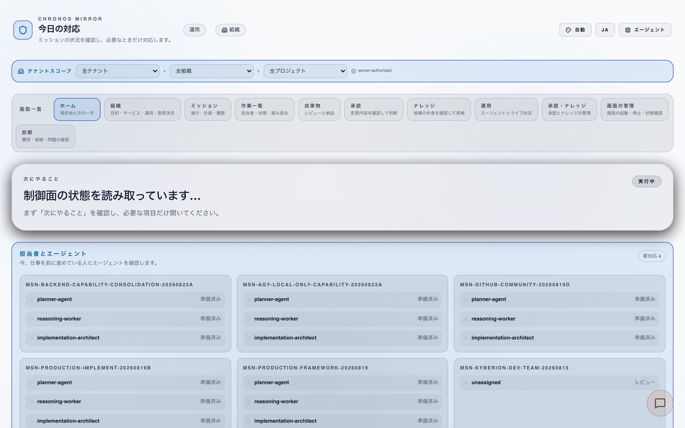</a><br /><strong>Chronos Mirror</strong> · <code>:3000</code><br /><sub>Control tower: what is the system doing, where should I intervene?</sub></td>
    <td align="center" width="33%"><a href="./presence/displays/concierge/">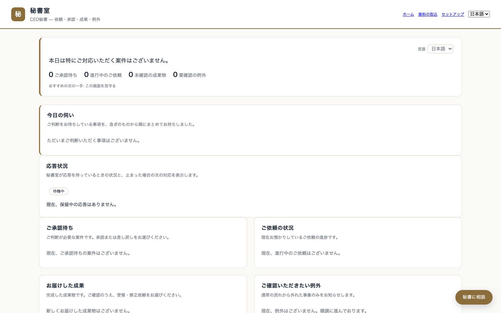</a><br /><strong>Concierge</strong> · <code>:3050</code><br /><sub>CEO secretary: what do I need to decide right now?</sub></td>
    <td align="center" width="33%"><a href="./presence/displays/presence-studio/">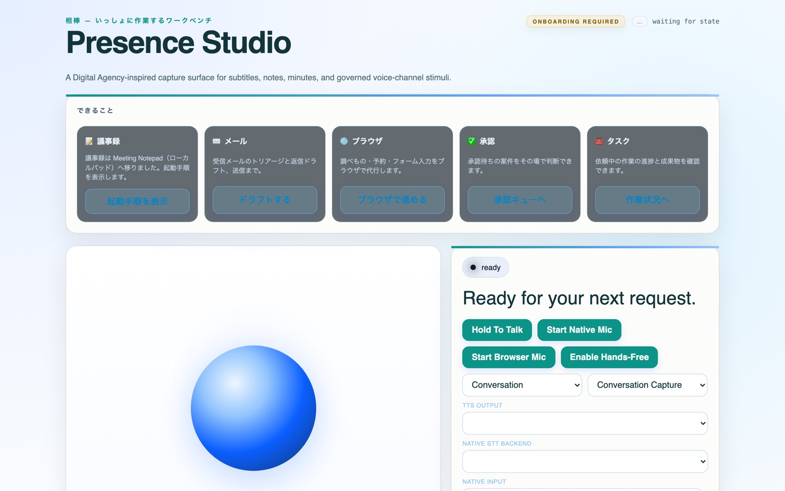</a><br /><strong>Presence Studio</strong> · <code>:3031</code><br /><sub>Companion: what are we working on together, by voice or text?</sub></td>
  </tr>
  <tr>
    <td align="center"><a href="./presence/displays/operator-surface/">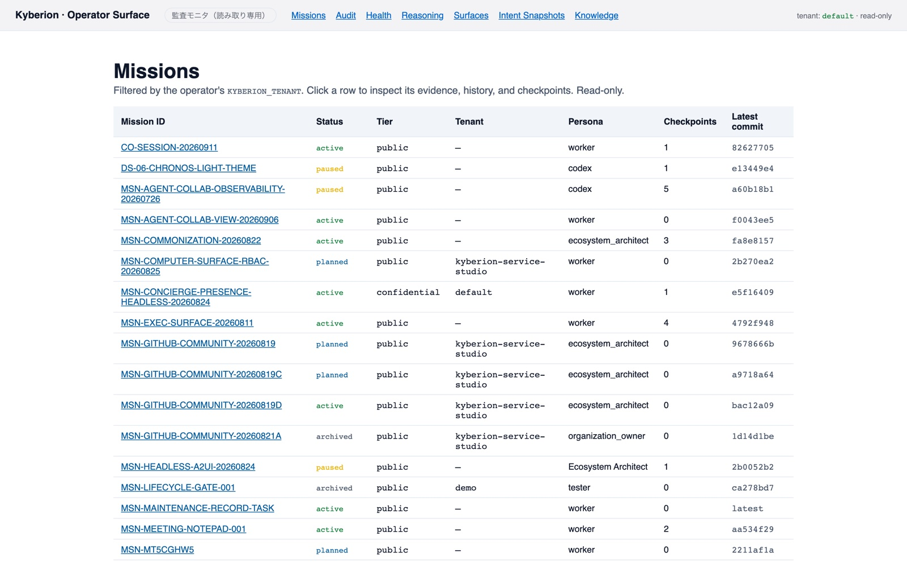</a><br /><strong>Operator Surface</strong> · <code>:3331</code><br /><sub>Audit monitor, read-only: what happened, with evidence?</sub></td>
    <td align="center"><a href="./presence/displays/computer-surface/">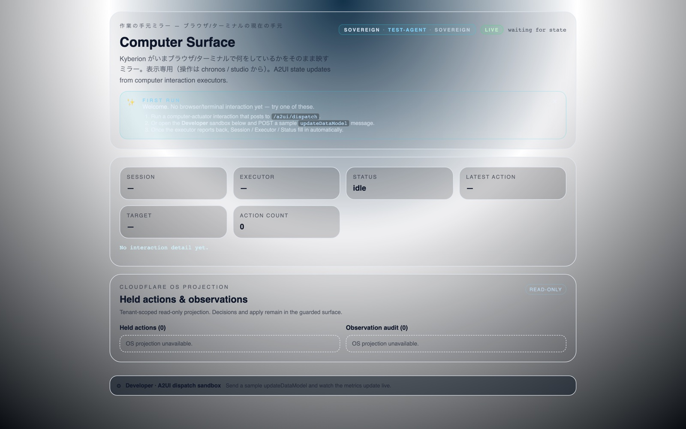</a><br /><strong>Computer Surface</strong> · <code>:3040</code><br /><sub>Mirror: what is Kyberion doing in the browser or terminal right now?</sub></td>
    <td align="center"><a href="./presence/displays/terminal-hud/">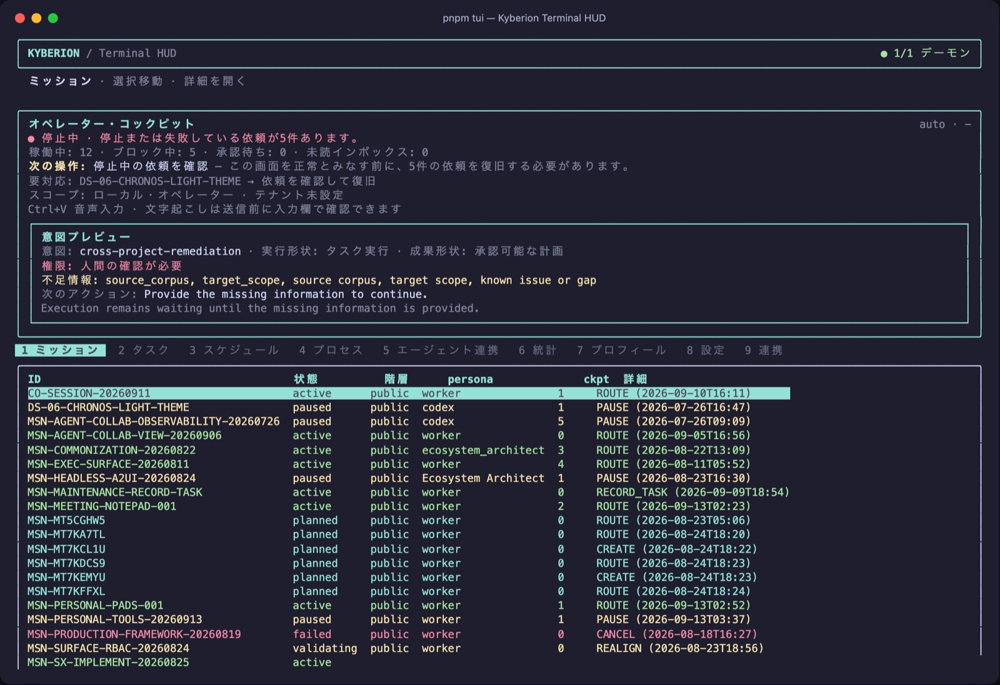</a><br /><strong>Terminal HUD</strong> · <code>pnpm tui</code><br /><sub>Terminal cockpit: missions, work items, runtimes and intent preview without leaving the shell</sub></td>
  </tr>
</table>

```bash
pnpm surfaces reconcile              # start the surfaces declared in active-surfaces.json
pnpm chronos:dev                     # or run the control tower alone
pnpm tui                             # terminal HUD (pnpm tui --once for a non-interactive snapshot)
```

Every HTTP surface resolves the viewer principal server-side and treats a client-supplied `tenant` only as a narrowing filter. On Next.js 15+ a same-machine browser is recognised as loopback only through a surface token or `KYBERION_TRUST_PROXY=1` behind a proxy that sets `x-real-ip` (see [`CHANGELOG.md`](./CHANGELOG.md) and [`docs/developer/CHRONOS_VIEWER_SCOPE_OPERATIONS.ja.md`](./docs/developer/CHRONOS_VIEWER_SCOPE_OPERATIONS.ja.md)).

---

## Local Pads — capture at your desk, hand off to Kyberion

Nine small **127.0.0.1-only** pages you run from the repo. Each one captures something you already have on your desk (a sketch, meeting notes, a screenshot, a file, a clipboard, today's TODO) and writes a session folder plus `handoff.json` that Kyberion can pick up. They load zero external resources, do all file I/O through `secure-io`, and never start a mission or send anything on their own.

<table>
  <tr>
    <td align="center" width="33%"><a href="./scripts/sketch-input/">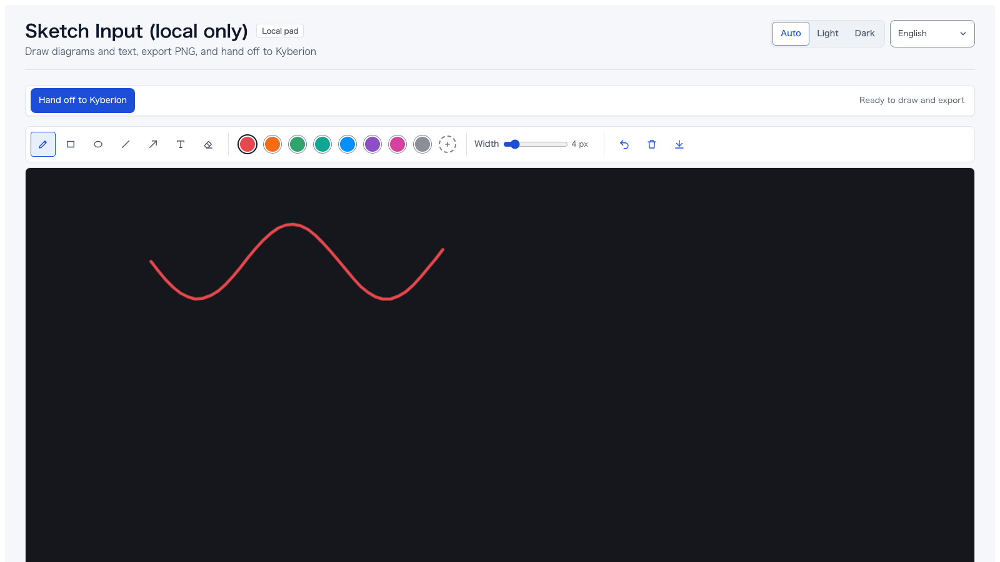</a><br /><strong>Sketch Input</strong> · <code>:8147</code><br /><sub>Draw a diagram, dictate the instruction, hand off PNG + JSON</sub></td>
    <td align="center" width="33%"><a href="./scripts/meeting-notepad/">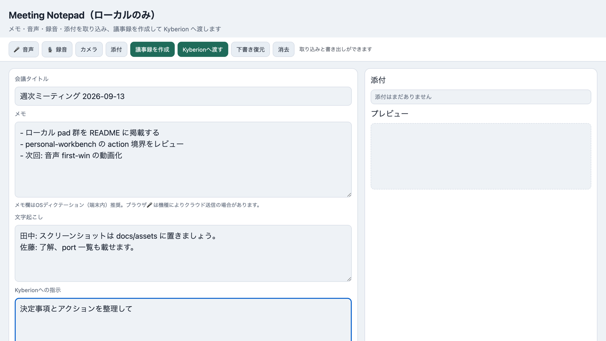</a><br /><strong>Meeting Notepad</strong> · <code>:8148</code><br /><sub>Notes + recording + attachments → minutes → handoff</sub></td>
    <td align="center" width="33%"><a href="./scripts/report-review/">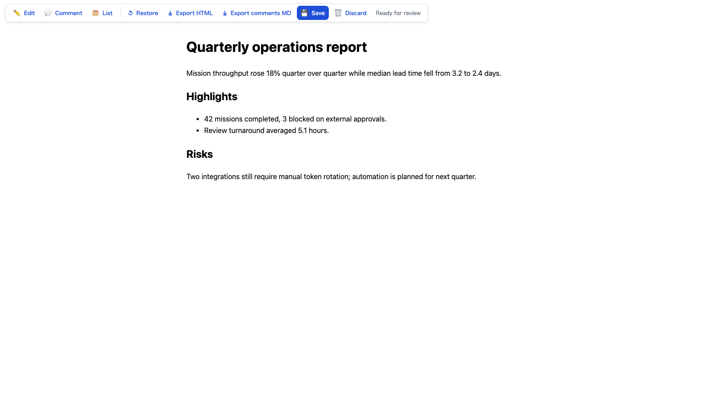</a><br /><strong>Report Review</strong> · <code>:8137</code><br /><sub>Edit / comment / dictate on any HTML report, save back in place</sub></td>
  </tr>
  <tr>
    <td align="center"><a href="./scripts/screenshot-annotate/">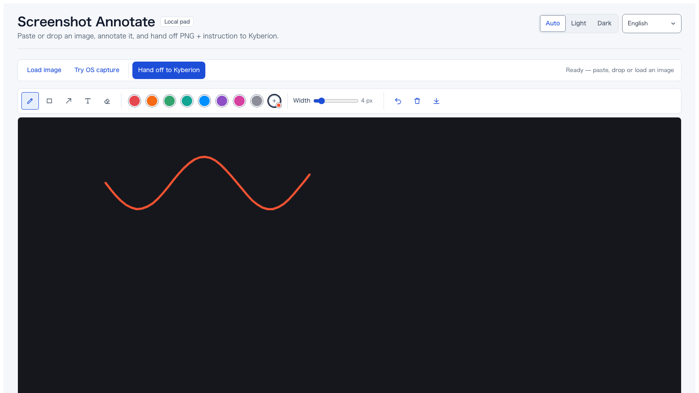</a><br /><strong>Screenshot Annotate</strong> · <code>:8150</code><br /><sub>Paste / drop an image, mark it up, hand off to vision</sub></td>
    <td align="center"><a href="./scripts/memory-capture/">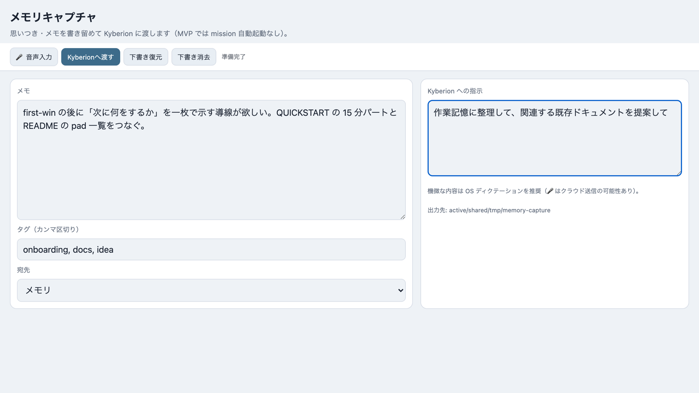</a><br /><strong>Memory Capture</strong> · <code>:8149</code><br /><sub>Brain-dump notes + tags → working-memory handoff</sub></td>
    <td align="center"><a href="./scripts/clipboard-inbox/">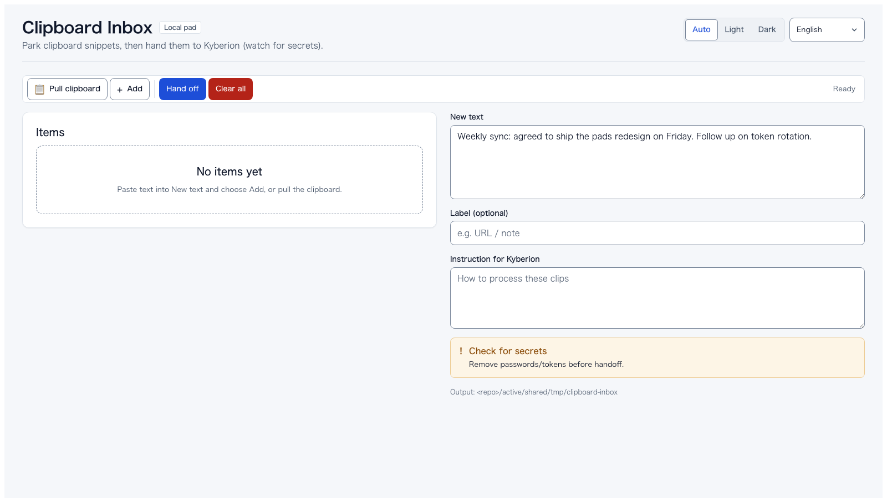</a><br /><strong>Clipboard Inbox</strong> · <code>:8151</code><br /><sub>Collect pasted snippets and URLs → inbox handoff</sub></td>
  </tr>
  <tr>
    <td align="center"><a href="./scripts/daily-desk/">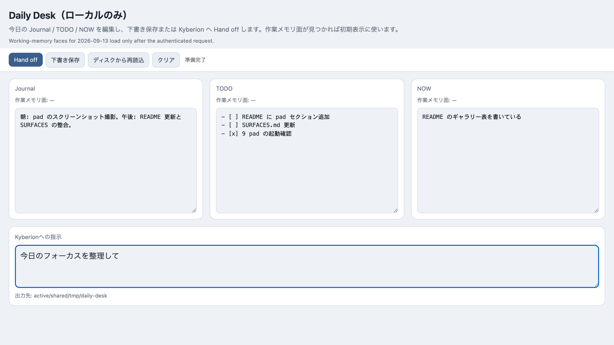</a><br /><strong>Daily Desk</strong> · <code>:8152</code><br /><sub>Journal / TODO / NOW faces, seeded from working memory</sub></td>
    <td align="center"><a href="./scripts/doc-drop/">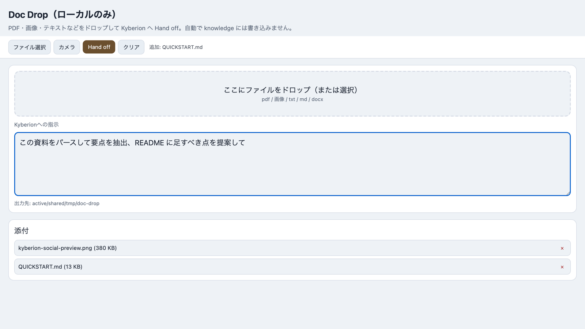</a><br /><strong>Doc Drop</strong> · <code>:8153</code><br /><sub>Drop PDF / images / text / docx → ingest handoff</sub></td>
    <td align="center"><a href="./scripts/personal-workbench/">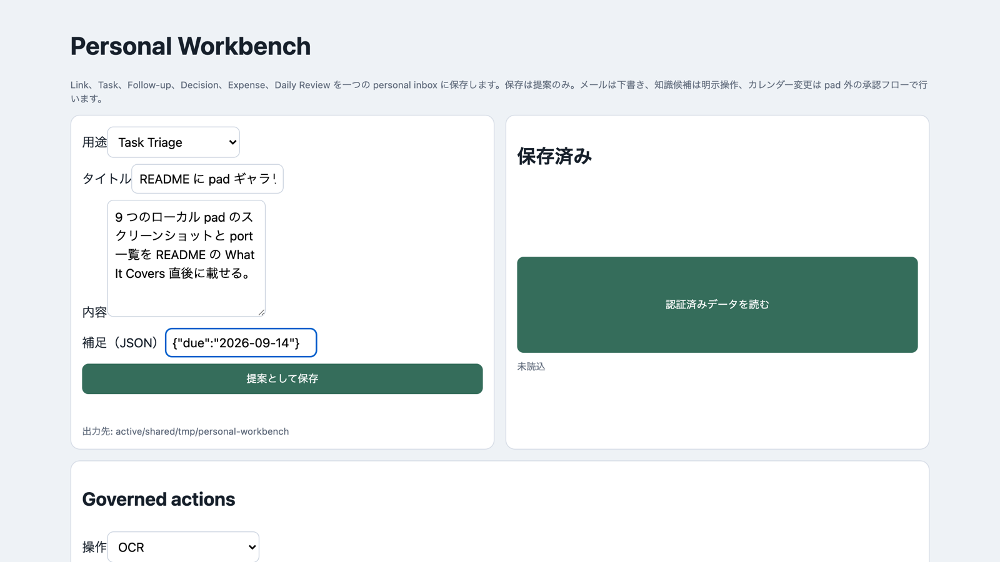</a><br /><strong>Personal Workbench</strong> · <code>:8154</code><br /><sub>Link / task / follow-up / decision / expense inbox; proposal-only, with governed OCR / email-draft actions</sub></td>
  </tr>
</table>

Start any of them the same way and open the printed URL:

```bash
KYBERION_PERSONA=sovereign KYBERION_TENANT=<tenant-slug> \
  node_modules/.bin/tsx scripts/meeting-notepad/server.ts        # or sketch-input, daily-desk, …

# report-review wraps an existing report instead of a blank page
KYBERION_PERSONA=sovereign KYBERION_TENANT=<tenant-slug> \
  node_modules/.bin/tsx scripts/report-review/server.ts active/shared/tmp/report.html
```

What they share:

- **Loopback only.** Bind to `127.0.0.1`, reject other origins, and require the per-run token printed at startup for every write. The token is not a substitute for human approval.
- **Tier and tenant on the command line.** `--tier public|confidential|personal --tenant <slug>` decide where the session lands; `confidential` / `personal` need a server-side `KYBERION_TENANT`, and Personal Workbench (default tier `personal`) always does.
- **Proposal, not execution.** Output is a session folder under `active/shared/tmp/<pad>/` plus `handoff.json`. Missions, sends, calendar changes and knowledge promotion stay behind the normal approval gates. Personal Workbench's `/action` exposes only governed OCR, a knowledge-promotion _candidate_, and email _drafts_.
- **One helper, many pads.** They are thin twins built on `scripts/lib/local-artifact-pad.ts` and registered in the protocol-service registry, so adding a pad is a small, reviewable change. Index: [`scripts/personal-pads/README.md`](./scripts/personal-pads/README.md).

---

## Project Status

**OSS, in active development.** Pre-1.0. The roadmap is in [`docs/PRODUCTIZATION_ROADMAP.md`](./docs/PRODUCTIZATION_ROADMAP.md):

- **Phase A** — Make first-win 5 minutes. (in progress)
- **Phase B** — Make it survive 30 days of continuous use. (foundations landed)
- **Phase C'** — Make it contributable in under a week.
- **Phase D'** — Make FDE / implementation-support engagements possible without forks.

The strategic positioning is **OSS-first, with paid implementation support / FDE** as the eventual revenue model. SaaS only after a clear user base exists. See `docs/PRODUCTIZATION_ROADMAP.md` §0 for the explicit "yes / no" list.

Multi-tenant isolation, the organization operating model, and viewer-scoped surface authorization have since landed as engineering foundations (tenant registry, work-item context chain, shared operation permissions, `KYBERION_VIEWER_SCOPE`); productized SaaS — billing, IdP/SSO, hosted user management — remains explicitly out of scope. The scoped RBAC boundary is documented in [`SURFACE_SCOPED_RBAC_AUTHORIZATION_PLAN_2026-08-24.ja.md`](./docs/developer/improvement-plans-2026-08/SURFACE_SCOPED_RBAC_AUTHORIZATION_PLAN_2026-08-24.ja.md), and implementation status per improvement plan is tracked in the current status index: [`docs/developer/improvement-plans-2026-08/README.ja.md`](./docs/developer/improvement-plans-2026-08/README.ja.md).

---

## Documentation Map

| If you want to                     | Read                                                                                                                                           |
| ---------------------------------- | ---------------------------------------------------------------------------------------------------------------------------------------------- |
| Understand why this exists         | [`docs/WHY.md`](./docs/WHY.md) / [`.ja.md`](./docs/WHY.ja.md)                                                                                  |
| Try it in 5 minutes                | [`docs/QUICKSTART.md`](./docs/QUICKSTART.md)                                                                                                   |
| Deploy it for a customer           | [`docs/operator/DEPLOYMENT.md`](./docs/operator/DEPLOYMENT.md)                                                                                 |
| Browse what it can automate        | [`docs/SCENARIO_CATALOG.md`](./docs/SCENARIO_CATALOG.md)                                                                                       |
| Understand the architecture        | [`knowledge/product/architecture/organization-work-loop.md`](./knowledge/product/architecture/organization-work-loop.md)                       |
| Author a new actuator / pipeline   | [`docs/developer/EXTENSION_POINTS.md`](./docs/developer/EXTENSION_POINTS.md)                                                                   |
| Customize for a customer           | [`docs/developer/CUSTOMER_AGGREGATION.md`](./docs/developer/CUSTOMER_AGGREGATION.md) / [`.ja.md`](./docs/developer/CUSTOMER_AGGREGATION.ja.md) |
| Contribute                         | [`CONTRIBUTING.md`](./CONTRIBUTING.md)                                                                                                         |
| Understand the data flow / privacy | [`docs/PRIVACY.md`](./docs/PRIVACY.md) / [`.ja.md`](./docs/PRIVACY.ja.md)                                                                      |
| Pick a surface / entry point       | [`docs/SURFACES.md`](./docs/SURFACES.md)                                                                                                       |
| Run multi-tenant isolation         | [`knowledge/product/architecture/multi-tenant-operations.md`](./knowledge/product/architecture/multi-tenant-operations.md)                     |
| Operate viewer-scoped API access   | [`docs/developer/CHRONOS_VIEWER_SCOPE_OPERATIONS.ja.md`](./docs/developer/CHRONOS_VIEWER_SCOPE_OPERATIONS.ja.md)                               |
| Check what is actually implemented | [`docs/developer/improvement-plans-2026-08/README.ja.md`](./docs/developer/improvement-plans-2026-08/README.ja.md)                             |
| Report a security issue            | [`SECURITY.md`](./SECURITY.md)                                                                                                                 |

## Community

Questions, examples, and contribution paths are collected in the
[`community guide`](./docs/COMMUNITY.md). Use GitHub Discussions for how-to
questions and workflow showcases, Issues for reproducible bugs or focused
feature proposals, and the private process in [`SECURITY.md`](./SECURITY.md)
for vulnerabilities.

Three audiences, three folders:

- [`docs/user/`](./docs/user/) — using Kyberion to get work done.
- [`docs/operator/`](./docs/operator/) — running Kyberion as a service.
- [`docs/developer/`](./docs/developer/) — extending Kyberion.

---

## How It Compares

| You've used                       | What Kyberion adds                                                                                                                 |
| --------------------------------- | ---------------------------------------------------------------------------------------------------------------------------------- |
| **ChatGPT / Claude.ai**           | Stateful missions, governed execution, a catalog of actuators (browser, file, voice, …), audit chain, reusable memory across runs. |
| **Cursor**                        | Code is one actuator among many. The unit of work is a long-running mission with persistent state, not a single chat.              |
| **Computer Use / browser agents** | Mission-scoped state, tier-isolated knowledge, customer aggregation. The browser is one tool, not the substrate.                   |
| **Zapier / n8n / RPA**            | Replaces brittle rule chains with intent-driven plans. Plans survive site changes via Trace-fed reusable hints.                    |
| **AI Ops / agent SaaS**           | OSS, self-hostable, customer-data-stays-local. No central server. FDE-ready for implementation engagements.                        |

---

## License

MIT — see [`LICENSE`](./LICENSE).

Third-party dependencies and their licenses are inventoried by `pnpm license:audit` (writes `docs/legal/third-party-licenses.json`; generated, not committed).

## Code of Conduct

We follow the [Contributor Covenant](https://www.contributor-covenant.org/) — see [`CODE_OF_CONDUCT.md`](./CODE_OF_CONDUCT.md).

## Governance

Decision-making process: [`GOVERNANCE.md`](./GOVERNANCE.md). Maintainers: [`MAINTAINERS.md`](./MAINTAINERS.md). Code owners: [`CODEOWNERS`](./CODEOWNERS).

## Contributing

PRs welcome. See [`CONTRIBUTING.md`](./CONTRIBUTING.md). Security disclosure: [`SECURITY.md`](./SECURITY.md). Roadmap context: [`docs/PRODUCTIZATION_ROADMAP.md`](./docs/PRODUCTIZATION_ROADMAP.md).

---

> Kyberion is operator-facing in English, conceptually-authored in Japanese. Both languages are first-class. See [`docs/DOCUMENTATION_LOCALIZATION_POLICY.md`](./docs/DOCUMENTATION_LOCALIZATION_POLICY.md).
