# Kyberion

<p align="center">
  
</p>

<p align="center">
  <a href="https://opensource.org/licenses/MIT"></a>
  <a href="https://nodejs.org/">=24" src="https://img.shields.io/badge/Node.js-%3E%3D24.0.0-339933.svg?logo=node.js" /></a>
  <a href="https://github.com/famaoai-creator/kyberion/actions/workflows/ci.yml"></a>
  
</p>

<p align="center">
  
  
  
  
  
</p>

<p align="center"><strong>An organization work loop engine.</strong><br />You phrase outcomes. Kyberion plans, runs, and remembers with evidence.</p>

<p align="center">Intent → Plan → Result</p>

Kyberion turns a request into a visible plan and a verified result. You say `今週の進捗レポートを作って` or `この PDF をパワポにして`; it picks the tools, asks only when something is genuinely ambiguous, and hands back the result, the artifact, the evidence that future work builds on, and the next action.

It is OSS and self-hosted: your data stays on your machine, every side effect is governed, and every run leaves an audit trail.

## Start here

| I want to…                       | Go to                                                                                                                                             |
| -------------------------------- | ------------------------------------------------------------------------------------------------------------------------------------------------- |
| **Try it** (5 minutes)           | [Quick Start](#quick-start) → [`docs/QUICKSTART.md`](./docs/QUICKSTART.md)                                                                        |
| **Understand what it is**        | [What is Kyberion?](#what-is-kyberion) → [`docs/WHY.md`](./docs/WHY.md) ([日本語](./docs/WHY.ja.md))                                              |
| **See what it can do**           | [What it can do](#what-it-can-do) → [`docs/SCENARIO_CATALOG.md`](./docs/SCENARIO_CATALOG.md) · [`CAPABILITIES_GUIDE.md`](./CAPABILITIES_GUIDE.md) |
| **Use it day to day**            | [How you work with it](#how-you-work-with-it) → [`docs/SURFACES.md`](./docs/SURFACES.md) · [`docs/user/`](./docs/user/)                           |
| **Deploy / operate it**          | [`docs/operator/DEPLOYMENT.md`](./docs/operator/DEPLOYMENT.md) · [`docs/operator/`](./docs/operator/)                                             |
| **Extend it or contribute**      | [`docs/developer/EXTENSION_POINTS.md`](./docs/developer/EXTENSION_POINTS.md) · [`CONTRIBUTING.md`](./CONTRIBUTING.md)                             |
| **Look up a term**               | [`docs/GLOSSARY.md`](./docs/GLOSSARY.md) — three tiers: first-win, contributor, and FDE                                                           |
| **Check what is actually built** | [Project Status](#project-status) → [status index](./docs/developer/improvement-plans-2026-08/README.ja.md)                                       |

---

## What is Kyberion?

Knowledge work is moving from "I do this manually with LLM help" to "I delegate and verify". The winning system is not the most chat-fluent model but the engine that captures intent reliably, keeps evidence, and accumulates organizational memory. Full thesis: [`docs/WHY.md`](./docs/WHY.md).

<p align="center">
  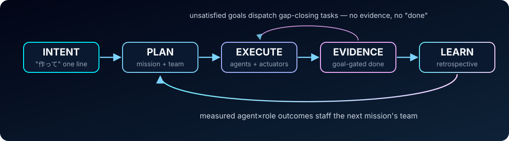
</p>

Most agent frameworks stop at "execute". Kyberion closes the loop:

- **No evidence, no "done".** Finishing a work cycle checks every success criterion against actual artifacts and verifications. Unsatisfied gaps automatically dispatch gap-closing work — the wording of a request never substitutes for its purpose.
- **The work loop improves itself.** Every finished work cycle runs a retrospective: deterministic execution stats ground improvement proposals (human-ratified, never auto-applied), and measured outcomes improve future staffing.
- **Frontier-model discipline on any model.** The [working philosophy](./knowledge/product/governance/working-philosophy.md) — read before write, one change one verification, no retry without a new hypothesis, evidence-based completion — is injected into every worker prompt, so small models inherit the habits that make frontier models reliable.
- **Governance by architecture, not by prompt.** Three-tier knowledge isolation is enforced at the file-IO boundary. Customer conversations are physically separated from mission state. Outbound sends always pass an approval gate. An append-only audit chain records everything.
- **Workers get briefed, not dumped.** Each worker receives a role-scoped context pack — mission goal, acceptance criteria, and the top hints distilled from previous runs — under an explicit size budget.

### Core concepts in one minute

| Concept            | What it is                                                                                                                                                                                                            |
| ------------------ | --------------------------------------------------------------------------------------------------------------------------------------------------------------------------------------------------------------------- |
| **Mission**        | One unit of work with its own git repo, state and evidence; survives 24h+ runs.                                                                                                                                       |
| **ADF / pipeline** | Declarative, schema-validated plan format (sub-pipelines, `on_error` recovery). Ready-made ones live in [`pipelines/`](./pipelines/README.md).                                                                        |
| **Actuator**       | A governed capability module (browser, file, voice, code, …). 33 today — [catalog](./CAPABILITIES_GUIDE.md).                                                                                                          |
| **Surface**        | A human-facing entrance: Chronos, Concierge, Presence Studio, terminal HUD, chat bridges, capture pads.                                                                                                               |
| **Tier & tenant**  | `personal/` → `confidential/` → `public/` knowledge, scoped per tenant; nothing leaks downward.                                                                                                                       |
| **Stance**         | `customer/{slug}/` overlay that swaps identity, connections and policy for the entity you act as — without forks. Not a tenant ([how they differ](./knowledge/product/architecture/stance-tenant-customer-model.md)). |

New here? Read [`docs/CORE_CONCEPTS.md`](./docs/CORE_CONCEPTS.md) — the 5 concepts you need first. Concept map: [`kyberion-concept-map`](./knowledge/product/architecture/kyberion-concept-map.md) · Parent architecture: [`organization-work-loop`](./knowledge/product/architecture/organization-work-loop.md).

---

## Quick Start

> **Start here — canonical cold-start source: [`docs/QUICKSTART.md`](./docs/QUICKSTART.md)** (it also explains which onboarding command to use when). Map of all docs: [`docs/README.md`](./docs/README.md). This page is the short version. Day-2 tenant / organization / activation work: [`docs/INITIALIZATION.md`](./docs/INITIALIZATION.md). Documentation authority map: [`docs/documentation-source-map.json`](./docs/documentation-source-map.json).

Kyberion's first visible result comes in three short steps:

- 30 seconds: run `pnpm kyberion doctor` and see Kyberion's readiness/value boundary
- 5 minutes: run the clean browser smoke and get `active/shared/tmp/first-win-session.png`
- 15 minutes: read the Quickstart structure map, then inspect the pipeline and actuator entrypoints

Requires Node.js 24+ (`.nvmrc` / `package.json` engines) and pnpm.

```bash
git clone https://github.com/famaoai-creator/kyberion.git
cd kyberion
```

<!-- kyberion-first-win -->

```bash
pnpm install
pnpm build
pnpm env:bootstrap --manifest kyberion-toolchain
pnpm kyberion doctor
pnpm pipeline --input pipelines/verify-session.json
```

`env:bootstrap` verifies the Node 24+ floor and warns if Playwright browsers are missing. The last command opens a local first-win page and writes `active/shared/tmp/first-win-session.png`. `pnpm exec playwright install chromium` is optional: without Chromium the pipeline writes its governed text fallback instead of hiding the readiness result.

| Path            | Prerequisites                                    | Time         | Command                                            | Notes                                                                   |
| :-------------- | :----------------------------------------------- | :----------- | :------------------------------------------------- | :---------------------------------------------------------------------- |
| First-win       | Node 24+, pnpm                                   | ~5min        | the five commands above                            | Writes the screenshot (or the governed fallback)                        |
| Voice first-win | macOS only (native TTS; not available in Docker) | ~5min        | `pnpm pipeline --input pipelines/voice-hello.json` | Run after the browser smoke                                             |
| Docker          | Docker Desktop                                   | ~10min build | `docker compose --profile deploy up`               | Headless services only — voice/GUI actuators need the native macOS path |

**Not sure where to go next?** `pnpm kyberion setup report --persona first-time-user` is the entry guide: it tells you whether to start with Chronos, the concierge, the voice path, or a messaging surface, and whether auth/setup is still blocking that route. If a browser, voice, or media actuator is missing a local dependency, check it with `pnpm deps:check --actuator browser` (or `voice`, `media-generation`).

Already have onboarding JSON? Skip the wizard: `pnpm onboarding apply --identity knowledge/public/templates/onboarding/identity.example.json --dry-run` (copy and edit the template, then rerun without `--dry-run`).

To understand the structure in 15 minutes, read [`docs/QUICKSTART.md`](./docs/QUICKSTART.md) sections 4-10, then inspect [`pipelines/verify-session.json`](./pipelines/verify-session.json), [`CAPABILITIES_GUIDE.md`](./CAPABILITIES_GUIDE.md), and [`docs/developer/EXTENSION_POINTS.md`](./docs/developer/EXTENSION_POINTS.md). For a server / customer deployment: [`docs/operator/DEPLOYMENT.md`](./docs/operator/DEPLOYMENT.md).

---

## What it can do

Every capability is a governed actuator or a ready-made pipeline — nothing here is an unbounded shell. Op-level catalog: [`CAPABILITIES_GUIDE.md`](./CAPABILITIES_GUIDE.md) · pipelines: [`pipelines/README.md`](./pipelines/README.md).

| Area                           | What you get                                                                                                                                                                                                                                                                                    |
| ------------------------------ | ----------------------------------------------------------------------------------------------------------------------------------------------------------------------------------------------------------------------------------------------------------------------------------------------- |
| **Browser & desktop**          | Record a web flow once and replay it reliably; drive the desktop with screenshot grounding (Set-of-Marks detectors, OS accessibility on macOS / Windows); terminal (PTY) control.                                                                                                               |
| **Documents & media**          | Read PDF / PPTX / DOCX / XLSX / HTML; generate documents and slide decks from semantic briefs; image, audio and video perception and generation; narrated video.                                                                                                                                |
| **Voice**                      | Browser speech in, OS-native or self-hosted speech out; talking avatar; meeting join, minutes and follow-up.                                                                                                                                                                                    |
| **Code**                       | Refactor, scaffold, analyze, review; SDLC-cycle pipelines; delegated subagent work.                                                                                                                                                                                                             |
| **Services & network**         | Governed fetch; Slack / Google / Notion / Microsoft 365 / email / calendar integration; deployment and cloud-operation actuators.                                                                                                                                                               |
| **Knowledge & memory**         | Search, distill and reuse organizational hints, including zero-LLM history search (SQLite FTS5 + CJK trigram, tier-isolated); working memory; volatile-knowledge GC.                                                                                                                            |
| **Organization operations**    | Operating-model control plane (purpose, services, routine operations, incidents, cadences, decisions — six `work_shape` kinds beyond solution projects), governed project management, and the canonical context chain `tenant_slug → organization_id → project_id → mission_id → task_id`.      |
| **Multi-tenant & multi-agent** | Tenant registry with isolated knowledge roots, deny-unless-brokered cross-tenant access, an HMAC-signed peer mesh (`pnpm peer:register`), and Co-Session coordination for several provider CLIs in one checkout ([model](./knowledge/product/architecture/agent-communication-layer-model.md)). |
| **Governance & trust**         | Approval gate on every outbound effect, append-only audit chain, OTel-style traces, provenance-gated plugins (`pnpm plugin:install`; third-party code needs human approval), goal-driven workers with budgets and restart recovery.                                                             |

### One verb per sense

Day to day you rarely write a pipeline — you use one command per sense (Markdown on stdout, `--json` for structure):

| Direction          | Command                 | Direction           | Command                   |
| ------------------ | ----------------------- | ------------------- | ------------------------- |
| Document → text    | `pnpm kyberion read`    | Brief → document    | `pnpm kyberion write`     |
| Image → text       | `pnpm kyberion see`     | Prompt → image      | `pnpm kyberion draw`      |
| Audio → text       | `pnpm kyberion listen`  | Text → audio        | `pnpm kyberion speak`     |
| Video → timeline   | `pnpm kyberion watch`   | Document ↔ document | `pnpm kyberion diff`      |
| Ask in plain words | `pnpm kyberion ask "…"` | Approve / reject    | `pnpm kyberion approvals` |

`pnpm kyberion` with no arguments is the terminal home: a status digest plus your next move. Every command is listed in the generated [CLI Reference](./docs/CLI_REFERENCE.md); task-oriented notes are in the [Commands Guide](./docs/user/COMMANDS_GUIDE.md). Verb inventory: [`capability-verb-inventory`](./knowledge/product/orchestration/capability-verb-inventory.md).

### Design-system-governed output

PPTX and video are authored as semantic briefs; a single style cascade and text-measured layout fitting keep output on-brand without per-slide hand-tuning.

---

## How you work with it

Pick the entrance that fits the moment. All of them share the same missions, approvals and audit chain.

| Entrance                        | Use it when                                                      | Start                                    |
| ------------------------------- | ---------------------------------------------------------------- | ---------------------------------------- |
| **Terminal home / HUD**         | You live in a shell and want the next action.                    | `pnpm kyberion` · `pnpm tui`             |
| **Concierge / Presence Studio** | You want a front desk: ask, decide, follow progress.             | `pnpm surfaces reconcile`                |
| **Chronos**                     | You supervise: intervene, review artifacts, audit.               | `pnpm chronos:dev`                       |
| **Chat bridges & voice**        | You are in Slack / Telegram / Discord / iMessage, or hands-free. | [`docs/SURFACES.md`](./docs/SURFACES.md) |
| **Capture pads**                | You have something on your desk: a sketch, notes, a file.        | `pnpm pads`                              |

## Surfaces — one role per screen

Each surface answers one question and shows its role in the header. The two human-facing surfaces (Concierge and Presence Studio) share one five-item rail — ホーム / 頼む / 決める / 進み具合 / 設定 — so they read as a single front desk. Full role map, ports and access rules: [`docs/SURFACES.md`](./docs/SURFACES.md).

<table>
  <tr>
    <td align="center" width="33%"><a href="./presence/displays/chronos-mirror-v2/">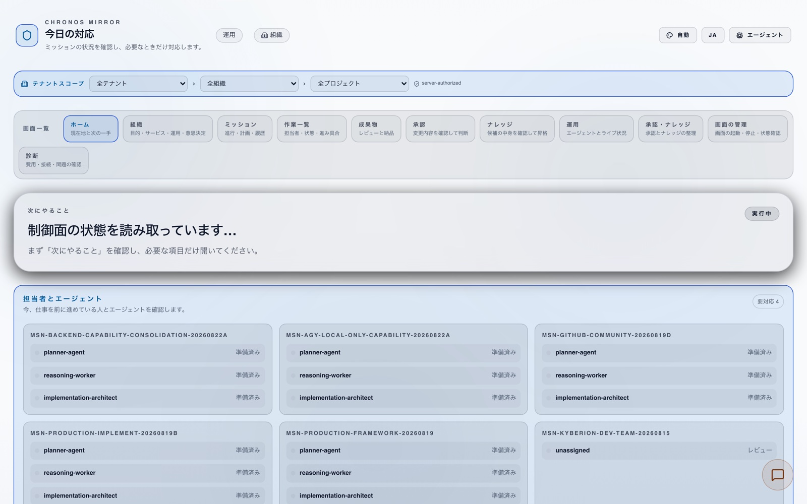</a><br /><strong>Chronos Mirror</strong> · <code>:3000</code><br /><sub>Control tower: what is the system doing, where should I intervene?</sub></td>
    <td align="center" width="33%"><a href="./presence/displays/concierge/">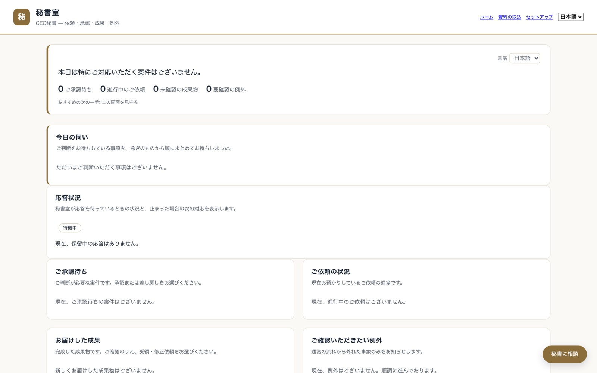</a><br /><strong>Concierge</strong> · <code>:3050</code><br /><sub>CEO secretary: what do I need to decide right now? (決める · 設定)</sub></td>
    <td align="center" width="33%"><a href="./presence/displays/presence-studio/">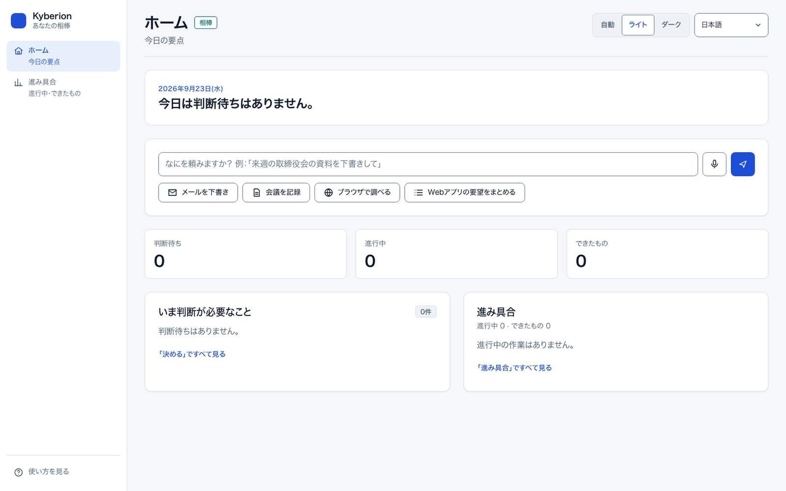</a><br /><strong>Presence Studio</strong> · <code>:3031</code><br /><sub>Companion: what are we working on together, by voice or text? (ホーム · 頼む · 進み具合)</sub></td>
  </tr>
  <tr>
    <td align="center"><a href="./presence/displays/operator-surface/">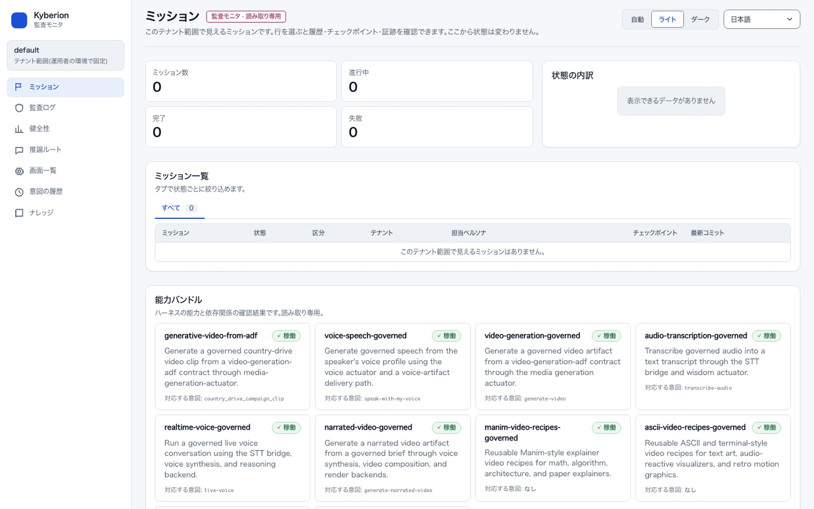</a><br /><strong>Operator Surface</strong> · <code>:3331</code><br /><sub>Audit monitor, read-only: what happened, with evidence?</sub></td>
    <td align="center"><a href="./presence/displays/computer-surface/">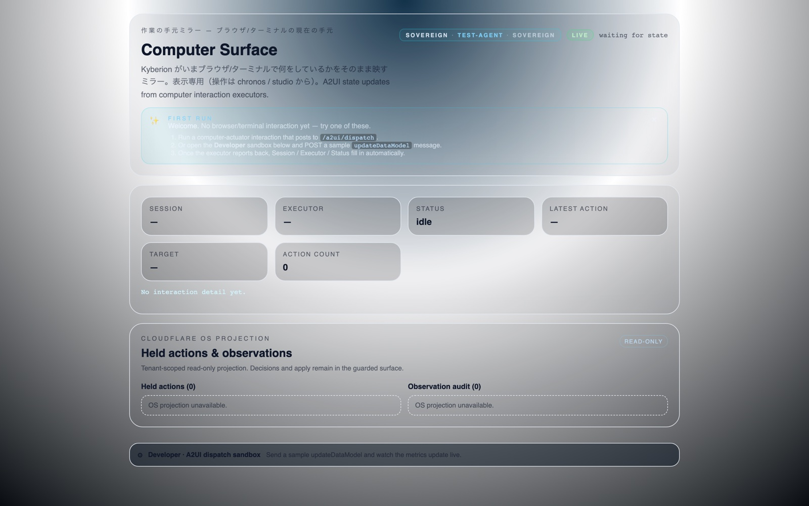</a><br /><strong>Computer Surface</strong> · <code>:3040</code><br /><sub>Mirror: what is Kyberion doing in the browser or terminal right now?</sub></td>
    <td align="center"><a href="./presence/displays/terminal-hud/">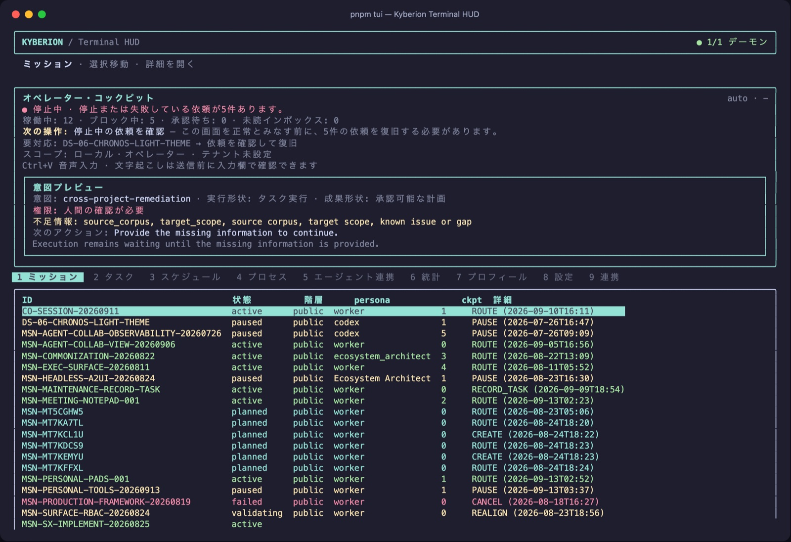</a><br /><strong>Terminal HUD</strong> · <code>pnpm tui</code><br /><sub>Terminal cockpit: missions, work items, runtimes and intent preview without leaving the shell</sub></td>
  </tr>
</table>

Beyond the screens, Slack / Telegram / Discord / iMessage bridges share one approval contract and a durable outbox (mechanisms hermetically tested; external-service E2E is still being proven), and voice runs through voice-hub and Presence Studio.

### Shared UI (A2UI kyberion-base)

All 5 UI surfaces above render from one design system: the `kyberion-base` A2UI catalog (`ui:*` component types with JSON Schema props), one token-driven stylesheet (`kyberion-ui.css`), and two renderers — React (`@agent/shared-ui`) for the three Next.js surfaces and a dependency-free vanilla DOM renderer for the two static-HTML surfaces. Every component ships in both light/dark themes and `en`/`ja` locales. See every component at once in Presence Studio's `/ui-gallery`:

<a href="./presence/displays/presence-studio/">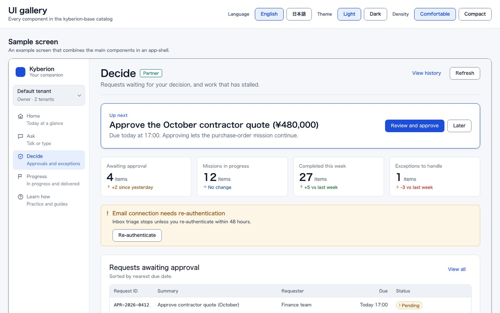</a>

Details, schema and CSS sources: [`docs/developer/design/DESIGN_SYSTEM.md`](./docs/developer/design/DESIGN_SYSTEM.md).

```bash
pnpm surfaces reconcile              # start the surfaces declared in active-surfaces.json
pnpm chronos:dev                     # or run the control tower alone
pnpm tui                             # terminal HUD (pnpm tui --once for a non-interactive snapshot)
```

### Access control

Every HTTP surface resolves a viewer principal and tenant scope server-side (`ViewerContext`); a client-supplied `tenant` only narrows what the viewer may already see, never widens it. Enforcement is staged via `KYBERION_VIEWER_SCOPE=off|warn|enforce` (default `warn`). `KYBERION_API_TOKEN` / `KYBERION_LOCALADMIN_TOKEN` remain compatible all-tenant tokens for the single-operator local workflow; scoped token registrations can restrict a viewer to selected tenants. On Next.js 15+ a same-machine browser is recognised as loopback only through a surface token or `KYBERION_TRUST_PROXY=1` behind a proxy that sets `x-real-ip`. Remote browsers sign in through a shared OIDC login (`/login`; Google and Microsoft Entra supported, a signed HttpOnly session cookie, only identities bound to an active member) — see [`docs/developer/SURFACE_OIDC_LOGIN_OPERATIONS.ja.md`](./docs/developer/SURFACE_OIDC_LOGIN_OPERATIONS.ja.md). Hosted user management is not implied by this boundary. Operations: [`docs/developer/CHRONOS_VIEWER_SCOPE_OPERATIONS.ja.md`](./docs/developer/CHRONOS_VIEWER_SCOPE_OPERATIONS.ja.md).

---

## Local Pads — capture at your desk, hand off to Kyberion

The **Capture desk** is one **127.0.0.1-only** server for the eight capture pads below. Start it once with `pnpm pads`, choose a pad from the menu, and inspect its authenticated history. It captures something you already have on your desk (a sketch, meeting notes, a screenshot, a file, a clipboard, today's TODO), stores records in the server-derived tenant/tier partition, and never starts a mission or sends anything on its own. The legacy per-pad pages remain available during migration. Every pad renders with the shared UI kit (toolbar, dialog, sketch board with a drawing palette, voice input with a live level meter) in light/dark and English/Japanese.

<table>
  <tr>
    <td align="center" width="33%"><a href="./scripts/sketch-input/">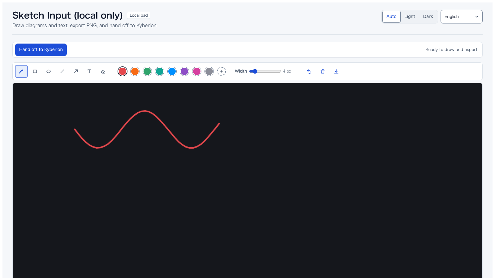</a><br /><strong>Sketch Input</strong> · <code>:8147</code><br /><sub>Draw a diagram, dictate the instruction, hand off PNG + JSON</sub></td>
    <td align="center" width="33%"><a href="./scripts/meeting-notepad/">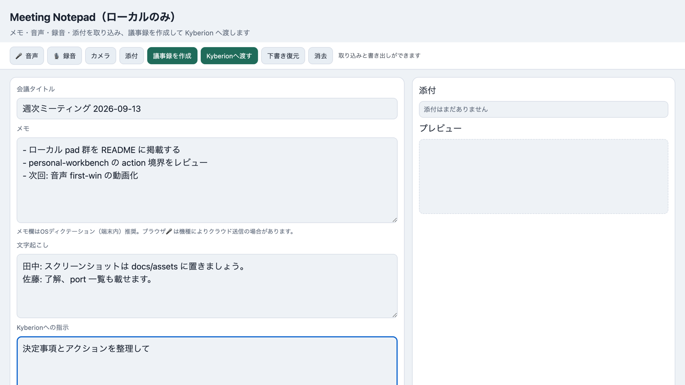</a><br /><strong>Meeting Notepad</strong> · <code>:8148</code><br /><sub>Notes + recording + attachments → minutes → handoff</sub></td>
    <td align="center" width="33%"><a href="./scripts/report-review/">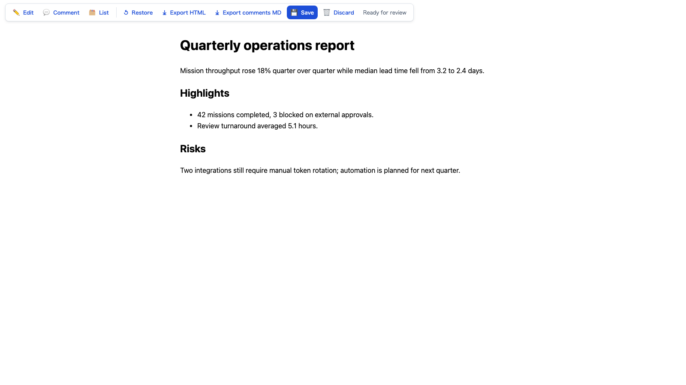</a><br /><strong>Report Review</strong> · <code>:8137</code><br /><sub>Edit / comment / dictate on any HTML report, save back in place</sub></td>
  </tr>
  <tr>
    <td align="center"><a href="./scripts/screenshot-annotate/">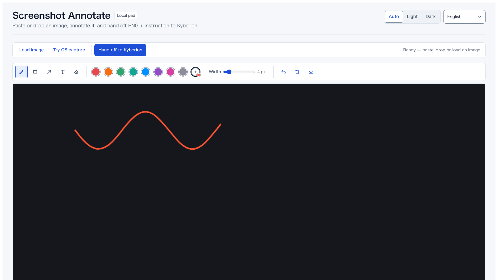</a><br /><strong>Screenshot Annotate</strong> · <code>:8150</code><br /><sub>Paste / drop an image, mark it up, hand off to vision</sub></td>
    <td align="center"><a href="./scripts/memory-capture/">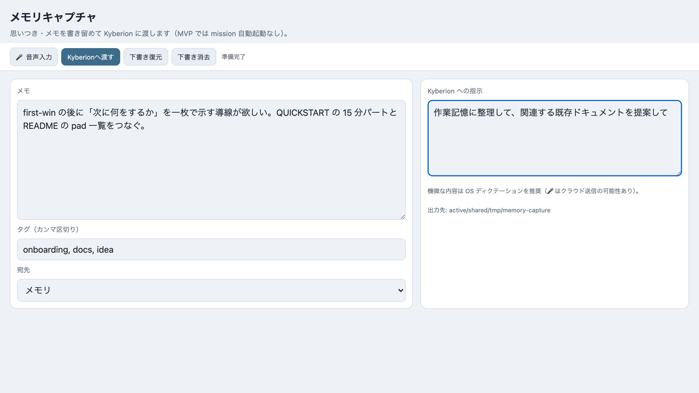</a><br /><strong>Memory Capture</strong> · <code>:8149</code><br /><sub>Brain-dump notes + tags → working-memory handoff</sub></td>
    <td align="center"><a href="./scripts/clipboard-inbox/">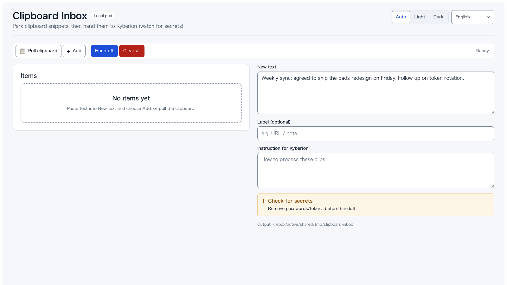</a><br /><strong>Clipboard Inbox</strong> · <code>:8151</code><br /><sub>Collect pasted snippets and URLs → inbox handoff</sub></td>
  </tr>
  <tr>
    <td align="center"><a href="./scripts/daily-desk/">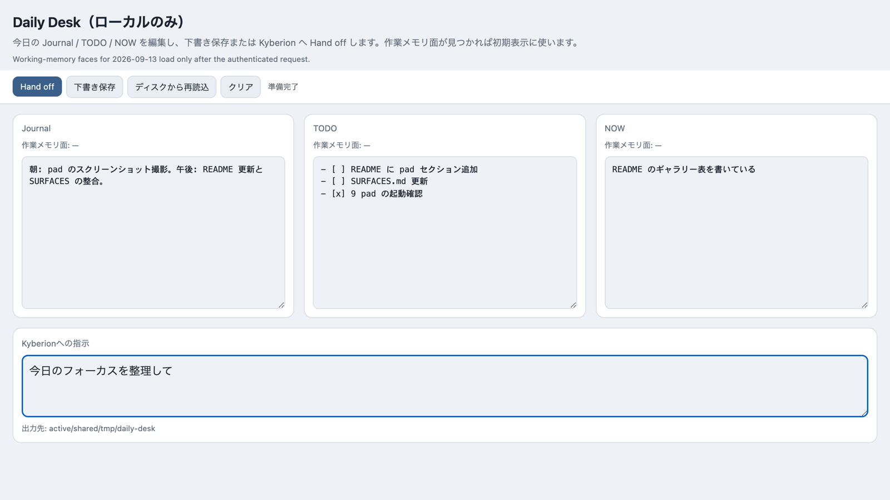</a><br /><strong>Daily Desk</strong> · <code>:8152</code><br /><sub>Journal / TODO / NOW faces, seeded from working memory</sub></td>
    <td align="center"><a href="./scripts/doc-drop/">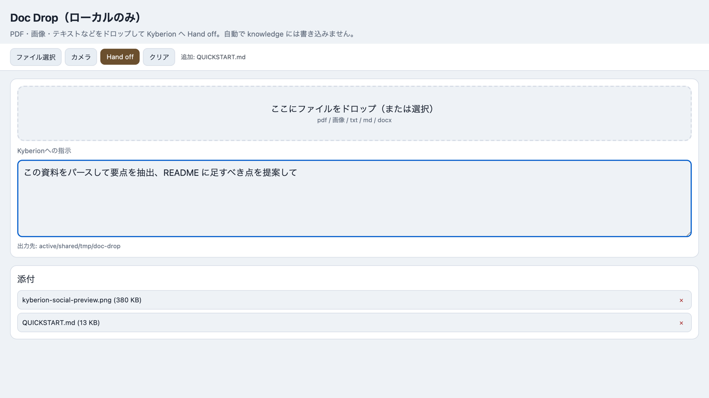</a><br /><strong>Doc Drop</strong> · <code>:8153</code><br /><sub>Drop PDF / images / text / docx → ingest handoff</sub></td>
    <td align="center"><a href="./scripts/personal-workbench/">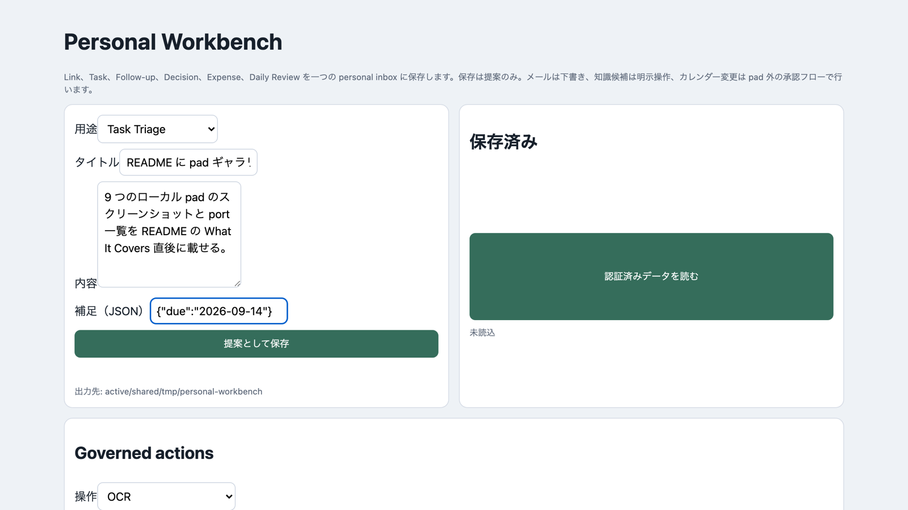</a><br /><strong>Personal Workbench</strong> · <code>:8154</code><br /><sub>Link / task / follow-up / decision / expense inbox; proposal-only, with governed OCR / email-draft actions</sub></td>
  </tr>
</table>

The `:81xx` ports above are the **legacy standalone** ports (used only when you start a single pad directly, see below). `pnpm pads` serves every pad from one server on `http://127.0.0.1:8160/`.

Start the Capture desk and open the printed URL:

```bash
KYBERION_PERSONA=sovereign KYBERION_TENANT=<tenant-slug> pnpm pads
# open http://127.0.0.1:8160/

# Legacy individual entry point (still supported during migration)
KYBERION_PERSONA=sovereign KYBERION_TENANT=<tenant-slug> \
  node_modules/.bin/tsx scripts/meeting-notepad/server.ts        # or sketch-input, daily-desk, …

# report-review wraps an existing report instead of a blank page
KYBERION_PERSONA=sovereign KYBERION_TENANT=<tenant-slug> \
  node_modules/.bin/tsx scripts/report-review/server.ts active/shared/tmp/report.html
```

What they share:

- **Loopback only.** Bind to `127.0.0.1`, reject other origins, and require the per-run token printed at startup for every write. The token is not a substitute for human approval.
- **Tier and tenant on the command line.** `--tier public|confidential|personal --tenant <slug>` decide where the session lands; `confidential` / `personal` need a server-side `KYBERION_TENANT`, and Personal Workbench (default tier `personal`) always does.
- **Proposal, not execution.** The unified desk writes durable, scope-partitioned pad records and an authenticated history index. Legacy entry points continue to write their session folder under `active/shared/tmp/<pad>/` plus `handoff.json`. Missions, sends, calendar changes and knowledge promotion stay behind the normal approval gates. Personal Workbench's `/action` exposes only governed OCR, a knowledge-promotion _candidate_, and email _drafts_.
- **One helper, many pads.** They are thin twins built on `scripts/lib/local-artifact-pad.ts` and registered in the protocol-service registry, so adding a pad is a small, reviewable change. Index: [`scripts/personal-pads/README.md`](./scripts/personal-pads/README.md).

---

## Project Status

**OSS, in active development.** Pre-1.0. The roadmap is in [`docs/PRODUCTIZATION_ROADMAP.md`](./docs/PRODUCTIZATION_ROADMAP.md):

- **Phase A** — Make first-win 5 minutes. (in progress)
- **Phase B** — Make it survive 30 days of continuous use. (foundations landed)
- **Phase C'** — Make it contributable in under a week.
- **Phase D'** — Make FDE / implementation-support engagements possible without forks.

The strategic positioning is **OSS-first, with paid implementation support / FDE** as the eventual revenue model. SaaS only after a clear user base exists (see `docs/PRODUCTIZATION_ROADMAP.md` §0 for the explicit "yes / no" list).

Multi-tenant isolation, the organization operating model, and viewer-scoped surface authorization have landed as engineering foundations; productized SaaS — billing, IdP/SSO, hosted user management — remains explicitly out of scope. **The README describes the product; the source of truth for what is actually implemented is the status index:** [`docs/developer/improvement-plans-2026-08/README.ja.md`](./docs/developer/improvement-plans-2026-08/README.ja.md) (release history: [`CHANGELOG.md`](./CHANGELOG.md)).

---

## Documentation Map

| If you want to                     | Read                                                                                                                                           |
| ---------------------------------- | ---------------------------------------------------------------------------------------------------------------------------------------------- |
| Understand why this exists         | [`docs/WHY.md`](./docs/WHY.md) / [`.ja.md`](./docs/WHY.ja.md)                                                                                  |
| Try it in 5 minutes                | [`docs/QUICKSTART.md`](./docs/QUICKSTART.md)                                                                                                   |
| Fix a first-run problem            | [`docs/user/TROUBLESHOOTING.md`](./docs/user/TROUBLESHOOTING.md)                                                                               |
| Browse what it can automate        | [`docs/SCENARIO_CATALOG.md`](./docs/SCENARIO_CATALOG.md) · [`docs/user/USE_CASE_QUICKSTARTS.md`](./docs/user/USE_CASE_QUICKSTARTS.md)          |
| Pick a surface / entry point       | [`docs/SURFACES.md`](./docs/SURFACES.md)                                                                                                       |
| Run day-to-day operations          | [`docs/OPERATOR_UX_GUIDE.md`](./docs/OPERATOR_UX_GUIDE.md)                                                                                     |
| Deploy it for a customer           | [`docs/operator/DEPLOYMENT.md`](./docs/operator/DEPLOYMENT.md)                                                                                 |
| Understand the architecture        | [`knowledge/product/architecture/organization-work-loop.md`](./knowledge/product/architecture/organization-work-loop.md)                       |
| Author a new actuator / pipeline   | [`docs/developer/EXTENSION_POINTS.md`](./docs/developer/EXTENSION_POINTS.md)                                                                   |
| Customize for a customer           | [`docs/developer/CUSTOMER_AGGREGATION.md`](./docs/developer/CUSTOMER_AGGREGATION.md) / [`.ja.md`](./docs/developer/CUSTOMER_AGGREGATION.ja.md) |
| Understand the data flow / privacy | [`docs/PRIVACY.md`](./docs/PRIVACY.md) / [`.ja.md`](./docs/PRIVACY.ja.md)                                                                      |
| Run multi-tenant isolation         | [`knowledge/product/architecture/multi-tenant-operations.md`](./knowledge/product/architecture/multi-tenant-operations.md)                     |
| Operate viewer-scoped API access   | [`docs/developer/CHRONOS_VIEWER_SCOPE_OPERATIONS.ja.md`](./docs/developer/CHRONOS_VIEWER_SCOPE_OPERATIONS.ja.md)                               |
| Check what is actually implemented | [`docs/developer/improvement-plans-2026-08/README.ja.md`](./docs/developer/improvement-plans-2026-08/README.ja.md)                             |
| Contribute                         | [`CONTRIBUTING.md`](./CONTRIBUTING.md)                                                                                                         |
| Report a security issue            | [`SECURITY.md`](./SECURITY.md)                                                                                                                 |

Three audiences, three folders: [`docs/user/`](./docs/user/) (using Kyberion) · [`docs/operator/`](./docs/operator/) (running it as a service) · [`docs/developer/`](./docs/developer/) (extending it). Questions and showcases: [`docs/COMMUNITY.md`](./docs/COMMUNITY.md) — GitHub Discussions for how-to, Issues for reproducible bugs, [`SECURITY.md`](./SECURITY.md) for vulnerabilities.

---

## How It Compares

| You've used                       | What Kyberion adds                                                                                                                 |
| --------------------------------- | ---------------------------------------------------------------------------------------------------------------------------------- |
| **ChatGPT / Claude.ai**           | Stateful missions, governed execution, a catalog of actuators (browser, file, voice, …), audit chain, reusable memory across runs. |
| **Cursor**                        | Code is one actuator among many. The unit of work is a long-running mission with persistent state, not a single chat.              |
| **Computer Use / browser agents** | Mission-scoped state, tier-isolated knowledge, customer aggregation. The browser is one tool, not the substrate.                   |
| **Zapier / n8n / RPA**            | Replaces brittle rule chains with intent-driven plans. Plans survive site changes via Trace-fed reusable hints.                    |
| **AI Ops / agent SaaS**           | OSS, self-hostable, customer-data-stays-local. No central server. FDE-ready for implementation engagements.                        |

---

## Project

MIT licensed — [`LICENSE`](./LICENSE); third-party licenses are inventoried by `pnpm license:audit` (generated, not committed). We follow the [Contributor Covenant](https://www.contributor-covenant.org/) ([`CODE_OF_CONDUCT.md`](./CODE_OF_CONDUCT.md)). Governance: [`GOVERNANCE.md`](./GOVERNANCE.md) · [`MAINTAINERS.md`](./MAINTAINERS.md) · [`CODEOWNERS`](./CODEOWNERS). PRs welcome — see [`CONTRIBUTING.md`](./CONTRIBUTING.md).

> Kyberion is operator-facing in English, conceptually-authored in Japanese. Both languages are first-class. See [`docs/DOCUMENTATION_LOCALIZATION_POLICY.md`](./docs/DOCUMENTATION_LOCALIZATION_POLICY.md).
