# Capability seam bindings

> Generated by `pnpm kyberion generate capability-seams`. Do not edit manually.

This graph is the DH-07 backstop for the seams currently migrated to `defineSeam`.
The absence of a provider in this snapshot is valid for optional/runtime-probed seams;
the declaration and consumer roles must still be present.

```mermaid
flowchart LR
  seam_a2a_route["a2a-route\nsole"]
  declaration_seam_a2a_route["declaration\nlibs/core/a2a-route-port.ts"] --> seam_a2a_route
  seam_a2a_route --> consumer_seam_a2a_route_468500152["consumer\nlibs/core/a2a-bridge.ts"]
  seam_actuator_forwarding_port["actuator-forwarding-port\nsole"]
  declaration_seam_actuator_forwarding_port["declaration\nlibs/core/actuator-forwarding-port.ts"] --> seam_actuator_forwarding_port
  seam_actuator_forwarding_port --> consumer_seam_actuator_forwarding_port_100708369["consumer\nlibs/actuators/wisdom-actuator/src/compatibility/cross-actuator-forwarders.ts"]
  seam_actuator_capability_probe["actuator.capability-probe\nnamed"]
  declaration_seam_actuator_capability_probe["declaration\nlibs/core/src/actuator-capability.ts"] --> seam_actuator_capability_probe
  seam_actuator_capability_probe --> consumer_seam_actuator_capability_probe_625713221["consumer\nlibs/core/src/actuator-capability.ts"]
  provider_seam_actuator_capability_probe_716304642["provider\nbrowser-actuator"] --> seam_actuator_capability_probe
  provider_seam_actuator_capability_probe_2003658120["provider\ngemini-cli"] --> seam_actuator_capability_probe
  provider_seam_actuator_capability_probe_1776722494["provider\nmedia-actuator"] --> seam_actuator_capability_probe
  provider_seam_actuator_capability_probe_808632279["provider\nsystem-actuator"] --> seam_actuator_capability_probe
  provider_seam_actuator_capability_probe_1870744002["provider\nvision-actuator"] --> seam_actuator_capability_probe
  provider_seam_actuator_capability_probe_1380287540["provider\nvoice-actuator"] --> seam_actuator_capability_probe
  seam_agent_execution_port["agent-execution-port\nsole"]
  declaration_seam_agent_execution_port["declaration\nlibs/core/agent-execution-port.ts"] --> seam_agent_execution_port
  seam_agent_execution_port --> consumer_seam_agent_execution_port_1249588015["consumer\nlibs/actuators/agent-actuator/src/agent-actuator-helpers.ts"]
  seam_agent_runtime_ensurer["agent-runtime-ensurer\nsole"]
  declaration_seam_agent_runtime_ensurer["declaration\nlibs/core/agent-runtime-port.ts"] --> seam_agent_runtime_ensurer
  seam_agent_runtime_ensurer --> consumer_seam_agent_runtime_ensurer_1658984889["consumer\nlibs/core/agent-runtime-supervisor.ts"]
  provider_seam_agent_runtime_ensurer_211032189["provider\nruntime-supervisor"] --> seam_agent_runtime_ensurer
  seam_audit_forwarder["audit-forwarder\nsole"]
  declaration_seam_audit_forwarder["declaration\nlibs/core/audit-forwarder.ts"] --> seam_audit_forwarder
  seam_audit_forwarder --> consumer_seam_audit_forwarder_1539696109["consumer\nlibs/core/audit-chain.ts"]
  seam_deployment_adapter["deployment-adapter\nsole"]
  declaration_seam_deployment_adapter["declaration\nlibs/core/deployment-adapter.ts"] --> seam_deployment_adapter
  seam_deployment_adapter --> consumer_seam_deployment_adapter_1520977501["consumer\nlibs/actuators/deployment-actuator/src/deployment-actuator-helpers.ts"]
  seam_email_account_provider["email-account-provider\nnamed"]
  declaration_seam_email_account_provider["declaration\nlibs/core/email-account-catalog.ts"] --> seam_email_account_provider
  seam_email_account_provider --> consumer_seam_email_account_provider_310989594["consumer\nlibs/core/adapter-default-selection.ts"]
  seam_email_account_provider --> consumer_seam_email_account_provider_308034282["consumer\nscripts/email-workflow.ts"]
  provider_seam_email_account_provider_98466462["provider\ngmail"] --> seam_email_account_provider
  provider_seam_email_account_provider_1106239763["provider\noutlook"] --> seam_email_account_provider
  provider_seam_email_account_provider_114739264["provider\nyahoo"] --> seam_email_account_provider
  seam_embedding_backend["embedding-backend\nsole"]
  declaration_seam_embedding_backend["declaration\nlibs/core/embedding-backend.ts"] --> seam_embedding_backend
  seam_embedding_backend --> consumer_seam_embedding_backend_2040851460["consumer\nlibs/core/src/knowledge-index.ts"]
  seam_environment_capability_probe["environment.capability-probe\nnamed"]
  declaration_seam_environment_capability_probe["declaration\nlibs/core/environment-capability.ts"] --> seam_environment_capability_probe
  seam_environment_capability_probe --> consumer_seam_environment_capability_probe_1582547468["consumer\nlibs/core/environment-capability.ts"]
  seam_identity_context_resolver["identity-context-resolver\nsole"]
  declaration_seam_identity_context_resolver["declaration\nlibs/core/identity-context-bridge.ts"] --> seam_identity_context_resolver
  seam_identity_context_resolver --> consumer_seam_identity_context_resolver_846975033["consumer\nlibs/core/authority.ts"]
  seam_identity_context_resolver --> consumer_seam_identity_context_resolver_274862940["consumer\nlibs/core/tier-guard.ts"]
  provider_seam_identity_context_resolver_1475610435["provider\nauthority"] --> seam_identity_context_resolver
  seam_intent_extractor["intent-extractor\nsole"]
  declaration_seam_intent_extractor["declaration\nlibs/core/intent-extractor.ts"] --> seam_intent_extractor
  seam_intent_extractor --> consumer_seam_intent_extractor_1282887059["consumer\nlibs/core/mission-orchestration-worker.ts"]
  seam_intent_extractor --> consumer_seam_intent_extractor_789267267["consumer\nlibs/core/reasoning-bootstrap.ts"]
  seam_meeting_join_driver["meeting-join-driver\nnamed"]
  declaration_seam_meeting_join_driver["declaration\nlibs/core/meeting-join-driver.ts"] --> seam_meeting_join_driver
  seam_meeting_join_driver --> consumer_seam_meeting_join_driver_1204246362["consumer\nlibs/core/in-room-meeting-driver.ts"]
  provider_seam_meeting_join_driver_3541166["provider\nstub"] --> seam_meeting_join_driver
  seam_mission_worker_core_dispatcher["mission-worker-core-dispatcher\nsole"]
  declaration_seam_mission_worker_core_dispatcher["declaration\nlibs/core/mission-orchestration-worker-dispatch-port.ts"] --> seam_mission_worker_core_dispatcher
  seam_mission_worker_core_dispatcher --> consumer_seam_mission_worker_core_dispatcher_1700591897["consumer\nlibs/core/mission-orchestration-worker-part-core.ts"]
  seam_provider_health_resolver["provider-health-resolver\nsole"]
  declaration_seam_provider_health_resolver["declaration\nlibs/core/provider-health-view.ts"] --> seam_provider_health_resolver
  seam_provider_health_resolver --> consumer_seam_provider_health_resolver_997547564["consumer\nlibs/core/provider-health-registry.ts"]
  provider_seam_provider_health_resolver_1113744206["provider\nprovider-health-registry"] --> seam_provider_health_resolver
  seam_reasoning_backend["reasoning-backend\nsole"]
  declaration_seam_reasoning_backend["declaration\nlibs/core/reasoning-backend.ts"] --> seam_reasoning_backend
  seam_reasoning_backend --> consumer_seam_reasoning_backend_789267267["consumer\nlibs/core/reasoning-bootstrap.ts"]
  seam_risky_approval_handler["risky-approval-handler\nsole"]
  declaration_seam_risky_approval_handler["declaration\nlibs/core/risky-op-approval-port.ts"] --> seam_risky_approval_handler
  seam_risky_approval_handler --> consumer_seam_risky_approval_handler_1686404278["consumer\nlibs/core/risky-op-registry.ts"]
  seam_risky_approval_handler --> consumer_seam_risky_approval_handler_147257100["consumer\nlibs/core/acp-mediator.ts"]
  seam_secret_resolver["secret-resolver\nsole"]
  declaration_seam_secret_resolver["declaration\nlibs/core/secret-resolver.ts"] --> seam_secret_resolver
  seam_secret_resolver --> consumer_seam_secret_resolver_762080047["consumer\nlibs/core/service-secret-resolver.ts"]
  seam_speech_to_text_bridge["speech-to-text-bridge\nnamed"]
  declaration_seam_speech_to_text_bridge["declaration\nlibs/core/speech-to-text-bridge.ts"] --> seam_speech_to_text_bridge
  seam_speech_to_text_bridge --> consumer_seam_speech_to_text_bridge_1893193429["consumer\nlibs/actuators/voice-actuator/src/index.ts"]
  seam_streaming_stt_bridge["streaming-stt-bridge\nnamed"]
  declaration_seam_streaming_stt_bridge["declaration\nlibs/core/streaming-stt-bridge.ts"] --> seam_streaming_stt_bridge
  seam_streaming_stt_bridge --> consumer_seam_streaming_stt_bridge_1893193429["consumer\nlibs/actuators/voice-actuator/src/index.ts"]
  seam_streaming_tts_bridge["streaming-tts-bridge\nnamed"]
  declaration_seam_streaming_tts_bridge["declaration\nlibs/core/streaming-tts-bridge.ts"] --> seam_streaming_tts_bridge
  seam_streaming_tts_bridge --> consumer_seam_streaming_tts_bridge_1605715216["consumer\nlibs/core/streaming-tts-bridge.ts"]
  seam_structured_runner["structured-runner\nnamed"]
  declaration_seam_structured_runner["declaration\nlibs/core/mission-llm.ts"] --> seam_structured_runner
  seam_structured_runner --> consumer_seam_structured_runner_459792368["consumer\nlibs/core/mission-llm.ts"]
  seam_super_nerve_executor["super-nerve-executor\nsole"]
  declaration_seam_super_nerve_executor["declaration\nlibs/core/super-nerve-execution-port.ts"] --> seam_super_nerve_executor
  seam_super_nerve_executor --> consumer_seam_super_nerve_executor_1671502810["consumer\nlibs/actuators/orchestrator-actuator/src/super-nerve/index.ts"]
  seam_surface_provider["surface-provider\nnamed"]
  declaration_seam_surface_provider["declaration\nlibs/core/surface-interaction-model.ts"] --> seam_surface_provider
  seam_surface_provider --> consumer_seam_surface_provider_200249102["consumer\nlibs/core/surface-interaction-model.ts"]
  provider_seam_surface_provider_754680368["provider\nchronos"] --> seam_surface_provider
  provider_seam_surface_provider_98592["provider\ncli"] --> seam_surface_provider
  provider_seam_surface_provider_1671380268["provider\ndiscord"] --> seam_surface_provider
  provider_seam_surface_provider_733583490["provider\nimessage"] --> seam_surface_provider
  provider_seam_surface_provider_1276666629["provider\npresence"] --> seam_surface_provider
  provider_seam_surface_provider_109518736["provider\nslack"] --> seam_surface_provider
  provider_seam_surface_provider_1360467711["provider\ntelegram"] --> seam_surface_provider
  seam_task_intent_builder["task-intent-builder\nnamed"]
  declaration_seam_task_intent_builder["declaration\nlibs/core/task-session.ts"] --> seam_task_intent_builder
  seam_task_intent_builder --> consumer_seam_task_intent_builder_70525072["consumer\nlibs/core/task-session.ts"]
  provider_seam_task_intent_builder_1962627398["provider\nbootstrap-project"] --> seam_task_intent_builder
  provider_seam_task_intent_builder_869797099["provider\ncapture-photo"] --> seam_task_intent_builder
  provider_seam_task_intent_builder_1659989404["provider\ncross-project-remediation"] --> seam_task_intent_builder
  provider_seam_task_intent_builder_1545498968["provider\nevolve-agent-harness"] --> seam_task_intent_builder
  provider_seam_task_intent_builder_2045738649["provider\nfetch-external-data"] --> seam_task_intent_builder
  provider_seam_task_intent_builder_1349364622["provider\ngenerate-presentation"] --> seam_task_intent_builder
  provider_seam_task_intent_builder_428569460["provider\ngenerate-report"] --> seam_task_intent_builder
  provider_seam_task_intent_builder_923914962["provider\ngenerate-workbook"] --> seam_task_intent_builder
  provider_seam_task_intent_builder_2005097474["provider\nincident-informed-review"] --> seam_task_intent_builder
  provider_seam_task_intent_builder_1990477828["provider\ninspect-service"] --> seam_task_intent_builder
  provider_seam_task_intent_builder_1279873729["provider\nlifestyle-booking"] --> seam_task_intent_builder
  provider_seam_task_intent_builder_1894488127["provider\nrequest-approval"] --> seam_task_intent_builder
  provider_seam_task_intent_builder_1610207492["provider\nresolve-approval"] --> seam_task_intent_builder
  provider_seam_task_intent_builder_590886665["provider\nrestart-service"] --> seam_task_intent_builder
  provider_seam_task_intent_builder_1711592401["provider\nschedule-coordination"] --> seam_task_intent_builder
  provider_seam_task_intent_builder_571940802["provider\nsetup-messaging-bridge"] --> seam_task_intent_builder
  provider_seam_task_intent_builder_1131287478["provider\nstart-service"] --> seam_task_intent_builder
  provider_seam_task_intent_builder_1863290858["provider\nstop-service"] --> seam_task_intent_builder
  seam_task_plan_coordinator["task-plan-coordinator\nsole"]
  declaration_seam_task_plan_coordinator["declaration\nlibs/core/task-plan-coordinator-port.ts"] --> seam_task_plan_coordinator
  seam_task_plan_coordinator --> consumer_seam_task_plan_coordinator_1760537825["consumer\nlibs/core/task-executor.ts"]
  seam_voice_bridge["voice-bridge\nsole"]
  declaration_seam_voice_bridge["declaration\nlibs/core/voice-bridge.ts"] --> seam_voice_bridge
  seam_voice_bridge --> consumer_seam_voice_bridge_1252409090["consumer\nlibs/actuators/meeting-actuator/src/meeting-intelligence-ops.ts"]
  seam_voice_vad_backend["voice.vad-backend\nnamed"]
  declaration_seam_voice_vad_backend["declaration\nlibs/core/vad-registry.ts"] --> seam_voice_vad_backend
  seam_voice_vad_backend --> consumer_seam_voice_vad_backend_1944073681["consumer\nlibs/core/ten-vad-bridge.ts"]
  seam_voice_vad_backend --> consumer_seam_voice_vad_backend_204605890["consumer\nlibs/core/silero-vad-bridge.ts"]
  provider_seam_voice_vad_backend_1298713976["provider\nenergy"] --> seam_voice_vad_backend
```

## Runtime binding table

| Seam                           | Multiplicity | Declaration                                             | Providers                                                                                                                                                                                                                                                                                                                                                                                                                                                                                                                                                                              | Consumers                                                                     |
| ------------------------------ | ------------ | ------------------------------------------------------- | -------------------------------------------------------------------------------------------------------------------------------------------------------------------------------------------------------------------------------------------------------------------------------------------------------------------------------------------------------------------------------------------------------------------------------------------------------------------------------------------------------------------------------------------------------------------------------------- | ----------------------------------------------------------------------------- |
| a2a-route                      | sole         | libs/core/a2a-route-port.ts                             | none observed                                                                                                                                                                                                                                                                                                                                                                                                                                                                                                                                                                          | libs/core/a2a-bridge.ts                                                       |
| actuator-forwarding-port       | sole         | libs/core/actuator-forwarding-port.ts                   | none observed                                                                                                                                                                                                                                                                                                                                                                                                                                                                                                                                                                          | libs/actuators/wisdom-actuator/src/compatibility/cross-actuator-forwarders.ts |
| actuator.capability-probe      | named        | libs/core/src/actuator-capability.ts                    | browser-actuator (builtin) gemini-cli (builtin) media-actuator (builtin) system-actuator (builtin) vision-actuator (builtin) voice-actuator (builtin)                                                                                                                                                                                                                                                                                                                                                                                                                   | libs/core/src/actuator-capability.ts                                          |
| agent-execution-port           | sole         | libs/core/agent-execution-port.ts                       | none observed                                                                                                                                                                                                                                                                                                                                                                                                                                                                                                                                                                          | libs/actuators/agent-actuator/src/agent-actuator-helpers.ts                   |
| agent-runtime-ensurer          | sole         | libs/core/agent-runtime-port.ts                         | runtime-supervisor (builtin)                                                                                                                                                                                                                                                                                                                                                                                                                                                                                                                                                           | libs/core/agent-runtime-supervisor.ts                                         |
| audit-forwarder                | sole         | libs/core/audit-forwarder.ts                            | none observed                                                                                                                                                                                                                                                                                                                                                                                                                                                                                                                                                                          | libs/core/audit-chain.ts                                                      |
| deployment-adapter             | sole         | libs/core/deployment-adapter.ts                         | none observed                                                                                                                                                                                                                                                                                                                                                                                                                                                                                                                                                                          | libs/actuators/deployment-actuator/src/deployment-actuator-helpers.ts         |
| email-account-provider         | named        | libs/core/email-account-catalog.ts                      | gmail (builtin) outlook (builtin) yahoo (builtin)                                                                                                                                                                                                                                                                                                                                                                                                                                                                                                                                | libs/core/adapter-default-selection.ts scripts/email-workflow.ts           |
| embedding-backend              | sole         | libs/core/embedding-backend.ts                          | none observed                                                                                                                                                                                                                                                                                                                                                                                                                                                                                                                                                                          | libs/core/src/knowledge-index.ts                                              |
| environment.capability-probe   | named        | libs/core/environment-capability.ts                     | none observed                                                                                                                                                                                                                                                                                                                                                                                                                                                                                                                                                                          | libs/core/environment-capability.ts                                           |
| identity-context-resolver      | sole         | libs/core/identity-context-bridge.ts                    | authority (builtin)                                                                                                                                                                                                                                                                                                                                                                                                                                                                                                                                                                    | libs/core/authority.ts libs/core/tier-guard.ts                             |
| intent-extractor               | sole         | libs/core/intent-extractor.ts                           | none observed                                                                                                                                                                                                                                                                                                                                                                                                                                                                                                                                                                          | libs/core/mission-orchestration-worker.ts libs/core/reasoning-bootstrap.ts |
| meeting-join-driver            | named        | libs/core/meeting-join-driver.ts                        | stub (builtin)                                                                                                                                                                                                                                                                                                                                                                                                                                                                                                                                                                         | libs/core/in-room-meeting-driver.ts                                           |
| mission-worker-core-dispatcher | sole         | libs/core/mission-orchestration-worker-dispatch-port.ts | none observed                                                                                                                                                                                                                                                                                                                                                                                                                                                                                                                                                                          | libs/core/mission-orchestration-worker-part-core.ts                           |
| provider-health-resolver       | sole         | libs/core/provider-health-view.ts                       | provider-health-registry (builtin)                                                                                                                                                                                                                                                                                                                                                                                                                                                                                                                                                     | libs/core/provider-health-registry.ts                                         |
| reasoning-backend              | sole         | libs/core/reasoning-backend.ts                          | none observed                                                                                                                                                                                                                                                                                                                                                                                                                                                                                                                                                                          | libs/core/reasoning-bootstrap.ts                                              |
| risky-approval-handler         | sole         | libs/core/risky-op-approval-port.ts                     | none observed                                                                                                                                                                                                                                                                                                                                                                                                                                                                                                                                                                          | libs/core/risky-op-registry.ts libs/core/acp-mediator.ts                   |
| secret-resolver                | sole         | libs/core/secret-resolver.ts                            | none observed                                                                                                                                                                                                                                                                                                                                                                                                                                                                                                                                                                          | libs/core/service-secret-resolver.ts                                          |
| speech-to-text-bridge          | named        | libs/core/speech-to-text-bridge.ts                      | none observed                                                                                                                                                                                                                                                                                                                                                                                                                                                                                                                                                                          | libs/actuators/voice-actuator/src/index.ts                                    |
| streaming-stt-bridge           | named        | libs/core/streaming-stt-bridge.ts                       | none observed                                                                                                                                                                                                                                                                                                                                                                                                                                                                                                                                                                          | libs/actuators/voice-actuator/src/index.ts                                    |
| streaming-tts-bridge           | named        | libs/core/streaming-tts-bridge.ts                       | none observed                                                                                                                                                                                                                                                                                                                                                                                                                                                                                                                                                                          | libs/core/streaming-tts-bridge.ts                                             |
| structured-runner              | named        | libs/core/mission-llm.ts                                | none observed                                                                                                                                                                                                                                                                                                                                                                                                                                                                                                                                                                          | libs/core/mission-llm.ts                                                      |
| super-nerve-executor           | sole         | libs/core/super-nerve-execution-port.ts                 | none observed                                                                                                                                                                                                                                                                                                                                                                                                                                                                                                                                                                          | libs/actuators/orchestrator-actuator/src/super-nerve/index.ts                 |
| surface-provider               | named        | libs/core/surface-interaction-model.ts                  | chronos (builtin) cli (builtin) discord (builtin) imessage (builtin) presence (builtin) slack (builtin) telegram (builtin)                                                                                                                                                                                                                                                                                                                                                                                                                                           | libs/core/surface-interaction-model.ts                                        |
| task-intent-builder            | named        | libs/core/task-session.ts                               | bootstrap-project (builtin) capture-photo (builtin) cross-project-remediation (builtin) evolve-agent-harness (builtin) fetch-external-data (builtin) generate-presentation (builtin) generate-report (builtin) generate-workbook (builtin) incident-informed-review (builtin) inspect-service (builtin) lifestyle-booking (builtin) request-approval (builtin) resolve-approval (builtin) restart-service (builtin) schedule-coordination (builtin) setup-messaging-bridge (builtin) start-service (builtin) stop-service (builtin) | libs/core/task-session.ts                                                     |
| task-plan-coordinator          | sole         | libs/core/task-plan-coordinator-port.ts                 | none observed                                                                                                                                                                                                                                                                                                                                                                                                                                                                                                                                                                          | libs/core/task-executor.ts                                                    |
| voice-bridge                   | sole         | libs/core/voice-bridge.ts                               | none observed                                                                                                                                                                                                                                                                                                                                                                                                                                                                                                                                                                          | libs/actuators/meeting-actuator/src/meeting-intelligence-ops.ts               |
| voice.vad-backend              | named        | libs/core/vad-registry.ts                               | energy (builtin)                                                                                                                                                                                                                                                                                                                                                                                                                                                                                                                                                                       | libs/core/ten-vad-bridge.ts libs/core/silero-vad-bridge.ts                 |

## Completeness rule

- Every catalog seam has one declaration and at least one consumer entry.
- Provider provenance is emitted by the runtime catalog and is never inferred from the document.
