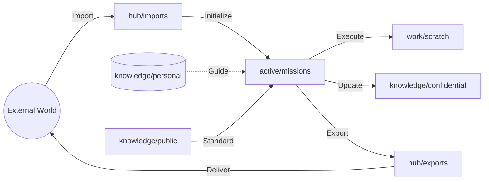

# Kyberion Ecosystem Map

本ドキュメントは、Kyberionエコシステムの物理的構造、運用的役割、およびナレッジの相関を網羅的に定義する主権マップである。

## 1. Directory Architecture (Physical Layer)

エコシステムは以下の4つの主要層（Tier）で構成される。

| 層 (Tier) | ディレクトリ | 役割・用途 | Git管理 | 機密レベル |
| :--- | :--- | :--- | :--- | :--- |
| **Hub** | `hub/imports/` | 外部からのミッション/データ搬入口 | No | Confidential |
| | `hub/exports/` | 成果物・レポートの外部搬出口 | No | Confidential |
| **Knowledge** | `knowledge/personal/` | 主権者のアイデンティティ・ビジョン | **No** | **Secret** |
| | `knowledge/confidential/` | ミッション固有の機密知識 | No | Confidential |
| | `knowledge/public/` | 共有プロトコル・公開ナレッジ | Yes | Public |
| **Mission** | `active/missions/` | 実行中のミッションの状態と契約 | No | Confidential |
| | `[MISSION_ID]/evidence/` | ミッション実行の証拠・ログ（Tierを継承） | No/Yes | Tier-Dependent |
| | `[MISSION_ID]/evidence/ledger.jsonl` | ミッション固有の詳細な実行台帳 | No | Tier-Dependent |
| | `work/` | 大規模データ処理用ワークスペース | No | Internal |
| | `scratch/` | 一時的なスクリプト・実験場 | No | Internal |
| **System** | `active/audit/system-ledger.jsonl` | システム全体のメタデータ台帳（Hybrid Ledger） | No | Internal |
| | `libs/` | コアロジック・アクチュエータ | Yes | Public/Code |
| | `presence/` | 外部センサー・インターフェース | Yes | Internal/Code |
| | `satellites/` | 外部サービス連携用ブリッジ | Yes | Internal/Code |
| | `vault/mounts/` | セキュアな外部ストレージマウント | No | Secret |

## 2. Data Flow (Operational Layer)

## 3. Knowledge Relationships (Logic Layer)

ナレッジ間の依存関係は、各ディレクトリ内の `README.md` および `_index.md` を参照せよ。主要なプロトコルは `knowledge/public/governance/` に集約されている。

---
*Status: Verified by Sovereign Onboarding v1.0*
