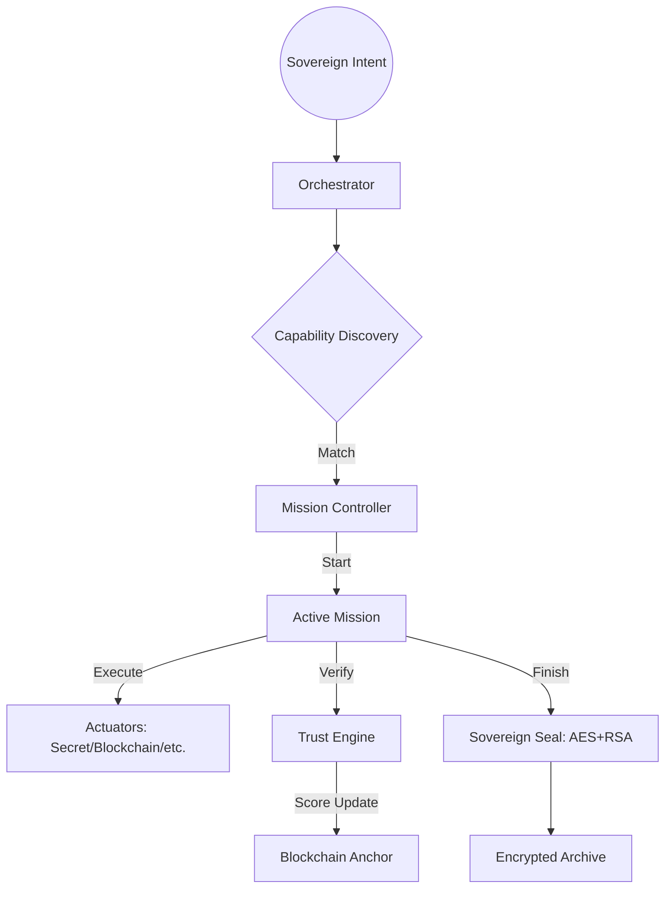

# Kyberion Ecosystem Map

本ドキュメントは、Kyberionエコシステムの物理的構造、運用的役割、およびナレッジの相関を網羅的に定義する主権マップである。

## 1. Directory Architecture (Physical Layer)

エコシステムは以下の4つの主要層（Tier）で構成される。

| 層 (Tier) | ディレクトリ | 役割・用途 | Git管理 (メイン) | 機密レベル |
| :--- | :--- | :--- | :--- | :--- |
| **Knowledge** | `knowledge/personal/` | 主権者の魂（アイデンティティ）・秘密鍵 | **No** | **Sovereign Secret** |
| | `knowledge/confidential/` | 組織の機密知識・ビジネスロジック | No | Confidential |
| | `knowledge/public/` | 共有プロトコル・公開ナレッジ | Yes | Public |
| **Mission** | `active/missions/` | 各ミッションの実行領域 | **No** | Tier-Dependent |
| | `[MISSION_ID]/.git/` | **独立履歴 (Micro-Git)**: 物理的に隔離された履歴 | **No** | Tier-Dependent |
| | `active/archive/` | 完了したミッションの保管庫（暗号化封印対応） | No | Tier-Dependent |
| **System** | `active/audit/` | **不変台帳**: Hybrid Ledger & Mock Blockchain | No | Internal |
| | `libs/actuators/` | 物理実行エンジン（能力申告マニフェスト付き） | Yes | Public/Code |
| | `libs/core/` | 統治ロジック・神経系コア | Yes | Internal/Code |
| | `vault/keys/` | 主権者公開鍵・Keychain連携秘密鍵 | No | Secret |

## 2. Dynamic Governance Flow (Operational Layer)

## 3. Core Governance Components

- **Sovereign Shield**: 独立した Micro-Git リポジトリによる、ミッション間の物理的な履歴隔離。
- **Trust Engine**: エージェントの実績に基づく動的スコアリングと、委託制限ガードレール。
- **Blockchain Anchor**: 全ミッションの指紋（ハッシュ）をブロックチェーンに刻印し、不変性を担保。
- **Secret Bridge**: OS（macOS Keychain等）と連携し、秘密情報をメモリ外に永続化させない仕組み。

---
*Status: Verified by Sovereign Architecture v2.0*
