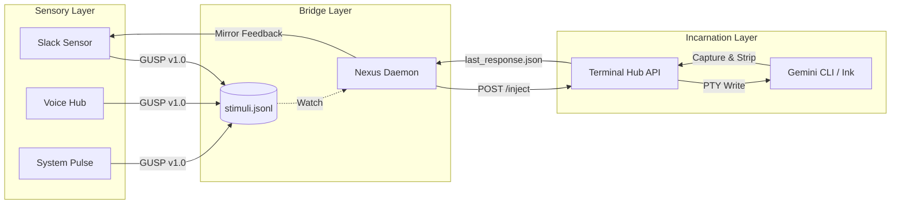

# Sensory Bridge Protocol (GUSP v1.0)

本ドキュメントは、Gemini エコシステムにおける外部刺激（Sensory Stimulus）の受容から、AI による自律実行、およびフィードバックまでの通信規約を定義する。

## 1. アーキテクチャ概観

エコシステムの神経系は、以下の3層構造で構成される。



## 2. Gemini Unified Sensory Protocol (GUSP) v1.0

すべてのセンサーは、以下のスキーマに従って `presence/bridge/stimuli.jsonl` に「刺激」を書き込まなければならない。

### 2.1 データ構造 (JSON)
```json
{
  "id": "req-20260305-abcd",      // ユニークID
  "ts": "ISO-8601 Timestamp",     // 発生時刻
  "ttl": 3600,                    // 有効期限 (秒)
  "origin": {
    "channel": "slack",           // 発生源 (slack|voice|system|internal)
    "source_id": "U12345",        // 発信者
    "context": "chan:thread"      // 返信コンテキスト (optional)
  },
  "signal": {
    "intent": "command",          // command|whisper|alert|broadcast
    "priority": 5,                // 1-10 (default: 5)
    "payload": "ls -la"           // 指示内容
  },
  "control": {
    "status": "pending",          // pending|injected|processed|expired|failed
    "feedback": "auto",           // auto|silent|manual
    "evidence": []                // 処理ステップの記録
  }
}
```

## 3. 構成コンポーネントの責務

### 3.1 センサー (Sensors)
- 外部イベントを検知し、GUSP 形式に変換。
- ユーザーへの「受付確認（ACK）」を即座に返し、`stimuli.jsonl` へ追記する。

### 3.2 Nexus Daemon (デーモン)
- `stimuli.jsonl` を監視し、`pending` 状態の刺激を処理。
- TTL をチェックし、期限切れの刺激を排除。
- アイドル状態のターミナル・ハブを特定し、API 経由で指示を注入。
- `last_response.json` を監視し、完了した成果を元の `origin.channel` へ送り返す。

### 3.3 Terminal Hub (ハブ)
- ブラウザへの WebSocket 配信と、外部からの `/inject` API を提供。
- **Ink/TUI 最適化**: 1文字ずつのタイピング・エミュレーションを行い、TUI アプリの入力取りこぼしを防止。
- **ANSI 剥離**: PTY 出力からエスケープシーケンスを除去し、プレーンテキストとしてフィードバックを永続化。

## 4. セキュリティとガバナンス
- **アクセス制御**: `/inject` API は原則として `localhost` からのみ受け付ける。
- **不揮発性**: セッション永続化により、物理的な接続が切れても AI の思考状態を保護する。
- **透明性**: `evidence` 配列により、一つの刺激がどのように処理されたかを物理的に追跡可能にする。
