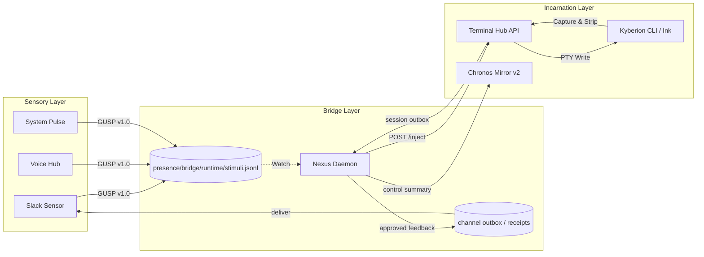

# Sensory Bridge Protocol (GUSP v1.0)

This document defines the transport contract from external stimuli ingestion to agent notification and channel feedback delivery.

## 1. アーキテクチャ概観

The sensory system is organized into three layers.



## 2. Kyberion Unified Sensory Protocol (GUSP) v1.0

All sensors must normalize incoming events into the canonical runtime journal:

- `presence/bridge/runtime/stimuli.jsonl`

### 2.1 Data Structure (JSON)
```json
{
  "id": "req-20260305-abcd",      // ユニークID
  "ts": "ISO-8601 Timestamp",     // 発生時刻
  "ttl": 3600,                    // 有効期限 (秒)
  "origin": {
    "channel": "slack",           // 発生源 (slack|voice|system|internal)
    "source_id": "U12345",        // 発信者
    "context": "chan:thread"      // 返信コンテキスト (optional)
  },
  "signal": {
    "intent": "command",          // command|whisper|alert|broadcast
    "priority": 5,                // 1-10 (default: 5)
    "payload": "ls -la"           // 指示内容
  },
  "control": {
    "status": "pending",          // pending|injected|processed|expired|failed
    "feedback": "auto",           // auto|silent|manual
    "evidence": []                // 処理ステップの記録
  }
}
```

## 3. Component responsibilities

### 3.1 Sensors
- detect external events and normalize them into GUSP
- return a fast channel-local acknowledgement when appropriate
- append stimuli to `presence/bridge/runtime/stimuli.jsonl`
- emit channel observability events into `active/shared/observability/channels/<channel>/`

### 3.2 Nexus Daemon
- watch `stimuli.jsonl` and process `pending` stimuli
- check TTL and expire dead stimuli
- find an eligible terminal or agent runtime and inject work
- read session-scoped response artifacts such as `active/shared/runtime/terminal/<session_id>/out/latest_response.json`
- write approved feedback envelopes into channel outboxes instead of depending on a single global response file

### 3.3 Terminal Hub
- provide WebSocket distribution and `/inject` APIs
- perform TUI-safe input delivery
- strip ANSI output and persist session-scoped response envelopes

### 3.4 Chronos Mirror v2
- provide the authenticated interactive control surface
- expose structured agent output and delegation summaries
- keep cached runtime handles only as an optimization, not as the durable system of record
- store durable coordination and observability artifacts outside the API route process

## 4. Security and governance
- **Access control**: `/inject` APIs should remain protected by loopback or authenticated gateway rules.
- **Durability**: session persistence protects in-flight terminal work from transient disconnects.
- **Transparency**: each stimulus should accumulate evidence and channel delivery receipts.
- **Mission authority**: channel bridges do not own missions. Mission ownership remains `single-owner, multi-worker`.
- **Compatibility boundary**: `active/shared/last_response.json` is now a legacy path and must not be treated as the canonical response source for new integrations.

For the full Slack and Chronos operating model, see:

- `knowledge/public/architecture/slack-chronos-control-model.md`
