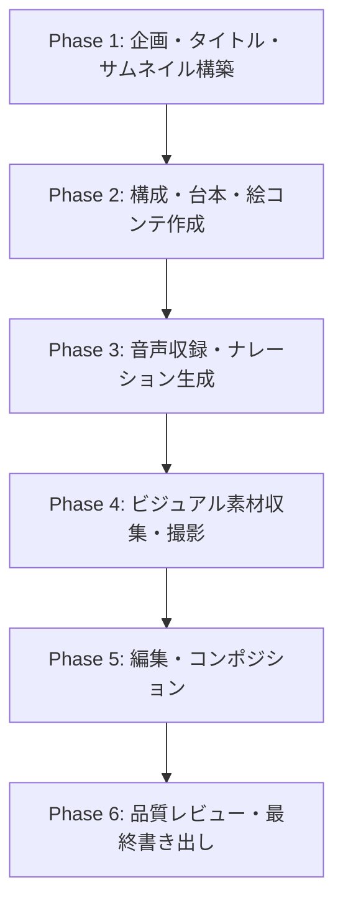
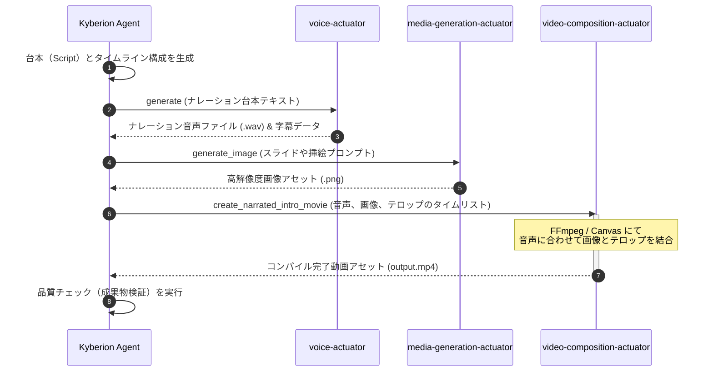

# Video Content Creation & Production Guide

本ガイドは、モダンな動画配信プラットフォーム（YouTubeやショート縦型動画など）において高い「視聴者維持率（Retention）」を誇るコンテンツ制作の極意と、Kyberionの自律実行エンジン・各種アクチュエータを活用した半自動動画制作のワークフローを体系化したパブリックナレッジです。

---

## 1. 視聴維持率（Retention）の設計科学

視聴者が動画を途中で離脱せず、最後まで楽しむ（あるいはコンバージョンする）構造は偶然ではなく、**データと人間行動学に基づき設計**されたものです。著名なトップクリエイター（MrBeastなど）のコンテンツは以下のフレームワークに忠実に作られています。

### ① 最初の30秒間：イミディエイト・フック (Immediate Hook)
離脱グラフが最も急降下するのが開始最初の30秒です。このフェーズでの最大の目標は「サムネイルとタイトルで約束した価値」を1秒たりとも無駄にせず証明することです。

*   **期待値の即時マッチ:** 動画の冒頭の1文と最初のカットで、視聴者がクリックした動機（タイトル・サムネイル）を肯定・回収します。
*   **ミッド・アクションスタート:** 「皆さんこんにちは、チャンネルへようこそ」といった挨拶やロゴアニメーションなどの「意味のない間（Dead Air）」は徹底的に排除し、本題やチャレンジ、核心シーンから開始します。
*   **価値のフロントロード:** 視聴を続けることで最終的に何が得られるのか（カタルシス、解決策、結末）を5〜10秒以内に明確に伝えます。

### ② ペーシングと緊張の管理（パターン・インターラプト）
視聴者が動画の途中で退屈し、スマホ画面から目を離してしまうのを防ぐために、視聴者の「脳の慣れ」をリセットし続けます。

*   **映像の多様性（カット・チェンジ）:** 2〜5秒ごとにカメラアングル、ズームレベル、インサート（B-Roll）、またはテロップ・グラフィックを動的に変更し、同じ絵面を長く見せない工夫を行います。
*   **エネルギーの波（エネルギーツイスト）:** 動画を「高エネルギー（フック）→ 中エネルギー（解説・伏線）→ 高エネルギー（再エンゲージメント・進展）」といったサイクルで波打たせる構成にし、平坦な説明が続くのを防ぎます。
*   **無音と環境音の活用:** ナレーションのない間の不要な空白を極限まで削る一方、効果音（SFX）やBGMの音量をメリハリよく使い分け、感情のトリガーを引きます。

### ③ 知的好奇心のオープンループ (Open Loops)
人間の「未完了のタスクや情報について知りたい」という心理（ツァイガルニク効果）を利用します。

*   **Curiosity Gap (好奇心の隙間):** 「そしてこの後、信じられない事態が起こります。しかしその前に……」のように、疑問や核心部分の手前で別のエピソードや解説を挟むことで、視聴者は答えを求めるために再生を維持します。
*   **3分のRESET（中盤の展開変更）:** 動画の中盤（3分や5分など、中だるみしやすい位置）で、新たなルール、障害、または予想外のゲストなどを登場させ、動画の第二幕を開始させます。

### ④ すっきりとした解決（カタルシス）と離脱防止
動画のピークを迎えた後はダラダラと喋らず、最も盛り上がった瞬間や明確な結論を示した後に数秒で動画を終わらせます。

*   動画が「自然消滅」するようなエンディングは避け、明解な感情の着地点（笑い、驚き、納得）を与えた上で次の動画カード（CTA）をシームレスに差し込みます。

---

## 2. エンド・ツー・エンド動画制作ワークフロー

動画コンテンツを制作する際の一連のプロフェッショナルな標準プロセスです。

| フェーズ | 主要アクティビティ | 成果物 |
| :--- | :--- | :--- |
| **Phase 1: 企画設計** | コンセプト決定、競合調査、**タイトルとサムネイル（構成案）を一番最初に設計する**。 | 企画書、仮サムネイル画像、タイトル案 |
| **Phase 2: シナリオ構成**| フック（最初の30秒）、中盤のRESET、エンディングを意識した台本の執筆。ビジュアルの指示書。 | ナレーション原稿、タイムライン指示書 |
| **Phase 3: 音声製作** | 録音、または生成AIやローカルTTSによるクリアなナレーション音声の準備。 | `.wav` / `.mp3` 音声アセット、字幕テキスト |
| **Phase 4: 素材確保** | 実写の画面録画、スライドの画像化、イラストやAIアセットの生成。 | 静止画・動画アセットフォルダ |
| **Phase 5: 映像編集** | 音声と映像のタイムライン同期、カット編集、BGM・SFXの追加、字幕テロップの挿入。 | ビデオプロジェクト、下書き動画 |
| **Phase 6: 品質レビュー** | 音量のバランスチェック、音声と字幕のズレ確認、離脱ポイントの自己批評。 | 最終検品済み `.mp4` ファイル |

---

## 3. Kyberionを活用した動画制作の自動化パイプライン

Kyberionプラットフォームには、これらのプロセスをAIと協調して半自動で実行するための**アクチュエータ**が高度に統合されています。

### 使用するコア・アクチュエータ
1.  **`voice-actuator` (音声合成エンジン):** 
    クローニングしたプロファイル（`user-cloned`等）を使用し、台本テキストから人間味のある自然なナレーション音声を瞬時に出力します。
2.  **`media-generation-actuator` (生成AI・キャプチャ):**
    *   `generate_image` / `generate_video` を使って、台本の内容にふさわしいプレミアムな視覚アセットをバックグラウンドで作成。
    *   `record_screen` を使用して、Webアプリなどの画面操作デモ動画を正確に録画。
3.  **`video-composition-actuator` (ビデオ・コンポジション):**
    *   `create_narrated_intro_movie` / `prepare_video_composition` を実行。音声トラック、静止画アセット、テロップの座標定義を「決定論的（Deterministic）」につなぎ合わせ、動画ファイルを自動レンダリングします。

### 自動コンポジションパイプライン構成図

---

## 4. クリエイターチェックリスト

動画を最終出力（レンダリング）する前に、以下のクオリティチェックを実行してください。

*   [ ] **サムネイルの約束を守っているか？**
    *   動画の開始5秒以内にサムネイルのビジュアルやキーワードと直接一致する要素が出現しているか。
*   [ ] **不要な沈黙（Dead Space）はないか？**
    *   文と文の間の不自然な間や呼吸音（リップノイズ）が編集で正しくカットされているか。
*   [ ] **5秒以上の「退屈な静止」がないか？**
    *   同じ静止画が表示され続ける場合、軽いズームイン（ケン・バーンズ効果）やテキスト表示、効果音が差し挟まれているか。
*   [ ] **オーディエンスファーストの語りか？**
    *   自分語りから始まらず、「あなた（視聴者）がどうなるか、何を得られるか」に終始フォーカスしているか。
*   [ ] **エンディングは簡潔か？**
    *   「以上です」「ご視聴ありがとうございました」といった終わりのシグナルを出す前に、最後の重要な価値を伝え、次のアクションを促して即座に終了しているか。

---

## 5. Kyberion における presentation mode の考え方

Kyberion では、動画の見せ方を `content_type` だけで決めません。  
`presentation_mode` を上位に置いて、**何を作るか** と **どう見せるか** を分けます。

### モードの役割

| mode | 目的 | レイアウトの傾向 | 向いている内容 |
|---|---|---|---|
| `howto` | 手順と再現性を見せる | `process-flow` / `howto-guide` | 操作手順、実行フロー、検証 |
| `promo` | 訴求と行動喚起を強く見せる | `promo-spot` | プロモーション、告知、LP 素材 |
| `vtuber` | 人格、対話、ライブ感を見せる | `vtuber-stage` | 配信、キャラ運用、雑談デモ |

### レイアウト決定の順序

1. `video-content-brief` で audience / objective / constraints を固定する。
2. `presentation_mode` で見せ方の方針を決める。
3. `video-storyboard` で beat ごとの役割と visual intent を作る。
4. `video-composition` で template を選び、HTML / CSS に落とす。

### 実務上の注意

- `howto` でも、内容が変われば `promo` や `vtuber` に寄せるべき場面がある。
- 逆に、`promo` でも proof が必要なら `evidence` 寄りの scene を混ぜる。
- 重要なのは固定の見た目ではなく、**content semantics に応じて layout family を切り替える**こと。
